# GRUPO-3 AndesHeavyTech

  

# UNIVERSIDAD PERUANA DE CIENCIAS APLICADAS

### FACULTAD DE INGENIERIA
### CARRERA DE INGENIERÍA DE SOFTWARE

 

# INFORME DE PROYECTO

## Nombre del proyecto
### MaquiControl

 

**Curso:**  
Desarrollo de Aplicaciones Open Source

**Sección:**  
7750

 

### Integrantes

| Integrante | Código |
|---|---|
| ANGIELA STEPHANY FUENTES ALVAREZ | U202520331 |
| NICOLAS TANTALEAN GRANDA | U202410728 |
| WILMER SEBASTIAN GUTIERREZ LIZARBE| U202412044 |
| MATHIAS ALEJANDRO CASTILLO GUEVARA | U202410783 |
| CARLOS GABRIEL CESPEDES LEZCANO | U202416147 |

 

**Docente:**  
Efrain Ricardo Bautista Ubillus

 

**Ciclo:**  
[2026-2]

 

**Lima, Perú**  
**2026**

## Tabla de Contenidos

<strong>Capítulo I: Introducción</strong>

- [1.1. Startup Profile](#11-startup-profile)
  - [1.1.1. Descripción de la Startup](#111-descripción-de-la-startup)
  - [1.1.2. Perfiles de integrantes del equipo](#112-perfiles-de-integrantes-del-equipo)

- [1.2. Solution Profile](#12-solution-profile)
  - [1.2.1. Antecedentes y problemática](#121-antecedentes-y-problemática)
    - [1.2.1.1. What](#1211-what)
    - [1.2.1.2. Who](#1212-who)
    - [1.2.1.3. Where](#1213-where)
    - [1.2.1.4. When](#1214-when)
    - [1.2.1.5. Why](#1215-why)
    - [1.2.1.6. How](#1216-how)
    - [1.2.1.7. How Much](#1217-how-much)

  - [1.2.2. Lean UX Process](#122-lean-ux-process)
  - [1.2.2.1. Lean UX Problem Statements](#1221-lean-ux-problem-statements)
  - [1.2.2.2. Lean UX Assumptions](#1222-lean-ux-assumptions)
  - [1.2.2.3. Lean UX Hypothesis Statements](#1223-lean-ux-hypothesis-statements)
  - [1.2.2.4. Lean UX Canvas](#1224-lean-ux-canvas)
- [1.3. Segmentos objetivo](#13-segmentos-objetivo)

<strong>Capítulo II: Requirements Elicitation & Analysis</strong>

- [2.1. Competidores](#21-competidores)
    - [2.1.1. Análisis competitivo](#211-análisis-competitivo)
    - [2.1.2. Estrategias y tácticas frente a competidores](#212-estrategias-y-tácticas-frente-a-competidores)
- [2.2. Entrevistas](#22-entrevistas)
    - [2.2.1. Diseño de entrevistas](#221-diseño-de-entrevistas)
    - [2.2.2. Registro de entrevistas](#222-registro-de-entrevistas)
    - [2.2.3. Análisis de entrevistas](#223-análisis-de-entrevistas)
- [2.3. Needfinding](#23-needfinding)
    - [2.3.1. User Personas](#231-user-personas)
    - [2.3.2. User Task Matrix](#232-user-task-matrix)
    - [2.3.3. User Journey Mapping](#233-user-journey-mapping)
    - [2.3.4. Empathy Mapping](#234-empathy-mapping)
- [2.4. Big Picture Event Storming](#24-big-picture-event-storming)
- [2.5. Ubiquitous Language](#25-ubiquitous-language)

<strong>Capítulo III: Requirements Specification</strong>

- [3.1. User Stories](#31-user-stories)
- [3.2. Impact Mapping](#32-impact-mapping)
- [3.3. Product Backlog](#33-product-backlog)

<strong>Capítulo IV: Product Design</strong>

- [4.1. Style Guidelines](#41-style-guidelines)
    - [4.1.1. General Style Guidelines](#411-general-style-guidelines)
    - [4.1.2. Web Style Guidelines](#412-web-style-guidelines)
- [4.2. Information Architecture](#42-information-architecture)
    - [4.2.1. Organization Systems](#421-organization-systems)
    - [4.2.2. Labeling Systems](#422-labeling-systems)
    - [4.2.3. SEO Tags and Meta Tags](#423-seo-tags-and-meta-tags)
    - [4.2.4. Searching Systems](#424-searching-systems)
    - [4.2.5. Navigation Systems](#425-navigation-systems)
- [4.3. Landing Page UI Design](#43-landing-page-ui-design)
    - [4.3.1. Landing Page Wireframe](#431-landing-page-wireframe)
    - [4.3.2. Landing Page Mock-up](#432-landing-page-mock-up)
- [4.4. Web Applications UX/UI Design](#44-web-applications-uxui-design)
    - [4.4.1. Wireframes](#441-web-applications-wireframes)
    - [4.4.2. Wireflow Diagrams](#442-web-applications-wireflow-diagrams)
    - [4.4.3. Mock-ups](#443-web-applications-mock-ups)
    - [4.4.4. User Flow Diagrams](#444-web-applications-user-flow-diagrams)
- [4.5. Web Applications Prototyping](#45-web-applications-prototyping)
- [4.6. Domain-Driven Software Architecture](#46-domain-driven-software-architecture)
    - [4.6.1. Design-Level Event Storming](#461-design-level-event-storming)
    - [4.6.2. Context Level Diagram](#462-software-architecture-context-level-diagram)
    - [4.6.3. Container Level Diagram](#463-software-architecture-container-level-diagram)
    - [4.6.4. Component Level Diagrams](#464-software-architecture-component-level-diagrams)
- [4.7. Software Object-Oriented Design](#47-software-object-oriented-design)
    - [4.7.1. Class Diagrams](#471-class-diagrams)
- [4.8. Database Design](#48-database-design)
    - [4.8.1. Database Diagrams](#481-database-diagrams)

<strong>Capítulo V: Product Implementation, Validation & Deployment</strong>

- [5.1. Software Configuration Management](#51-software-configuration-management)
    - [5.1.1. Development Environment Configuration](#511-software-development-environment-configuration)
    - [5.1.2. Source Code Management](#512-source-code-management)
    - [5.1.3. Style Guide & Conventions](#513-source-code-style-guide-conventions)
    - [5.1.4. Deployment Configuration](#514-software-deployment-configuration)
- [5.2. Landing Page, Services & Applications Implementation](#52-landing-page-services-applications-implementation)
    - [5.2.1. Sprint 1](#521-sprint-1)
        - [Sprint Planning 1](#5211-sprint-planning-1)
        - [Aspect Leaders and Collaborators](#5212-aspect-leaders-and-collaborators)
        - [Sprint Backlog 1](#5213-sprint-backlog-1)
        - [Development Evidence](#5214-development-evidence-for-sprint-review)
        - [Execution Evidence](#5215-execution-evidence-for-sprint-review)
        - [Services Documentation Evidence](#5216-services-documentation-evidence-for-sprint-review)
        - [Deployment Evidence](#5217-software-deployment-evidence-for-sprint-review)
        - [Team Collaboration Insights](#5218-team-collaboration-insights-during-sprint)
- [5.3. Validation Interviews](#53-validation-interviews)
    - [5.3.1. Diseño de Entrevistas](#531-diseño-de-entrevistas)
    - [5.3.2. Registro de Entrevistas](#532-registro-de-entrevistas)
    - [5.3.3. Evaluaciones según heurísticas](#533-evaluaciones-según-heurísticas)
- [5.4. Video About-the-Product](#54-video-about-the-product)

- [Conclusiones y recomendaciones](#conclusiones-y-recomendaciones)
- [Video About-the-Team](#video-about-the-team)
- [Bibliografía](#bibliografía)
- [Anexos](#anexos)
    - [Anexo: Videos de Exposiciones](#anexo-videos-de-exposiciones)

# MaquiControl

## Registro de Versiones del Informe

| Versión | Fecha | Autor(es) | Descripción de modificación |
| :---: | :---: | :--- | :--- |
| 0.1 | 08/09/2026 | Carlos Gabriel Cespedes Lezcano | Creación de la estructura inicial del informe y desarrollo del Capítulo I: Introducción, incluyendo Startup Profile, Solution Profile, Lean UX Process y segmentos objetivo. |
| 0.2 | 10/09/2026 | Carlos Gabriel Cespedes Lezcano y Nicolas Tantalean Granda | Desarrollo del análisis competitivo, estrategias frente a competidores, diseño y registro de entrevistas, así como el análisis preliminar de los segmentos objetivo. |
| 0.3 | 11/09/2026 | Carlos Gabriel Cespedes Lezcano y Mathias Alejandro Castillo Guevara | Desarrollo de artefactos de Needfinding, incluyendo User Personas, User Task Matrix y User Journey Mapping, además de la incorporación de perfiles de integrantes. |
| 0.4 | 14/09/2026 | Carlos Gabriel Cespedes Lezcano y Wilmer Sebastián Gutiérrez Lizarbe | Ampliación del análisis de entrevistas y desarrollo de User Personas, User Journey Mapping y Empathy Mapping para los segmentos objetivo. |
| 0.5 | 15/09/2026 | Carlos Gabriel Cespedes Lezcano, Nicolas Tantalean Granda y Mathias Alejandro Castillo Guevara | Corrección de información de entrevistas; incorporación de Big Picture Event Storming, Ubiquitous Language, User Stories, Product Backlog y nuevos artefactos de Needfinding. |
| 0.6 | 16/09/2026 | Angiela Stephany Fuentes Alvarez y Carlos Gabriel Cespedes Lezcano | Desarrollo de Student Outcome y del Capítulo IV: Product Design, incluyendo Style Guidelines, Information Architecture, Landing Page UI Design, Impact Mapping, Web Application UX/UI Design y arquitectura de software basada en DDD. |
| 0.7 | 17/09/2026 | Carlos Gabriel Cespedes Lezcano | Integración del registro de versiones, Project Report Collaboration Insights, Student Outcome y fotografías de los integrantes, conservando los avances existentes en la rama `develop`. |

## Project Report Collaboration 

**Link del Repositorio de la Organización:** [Organización](https://github.com/AndesHeavyTech)  
**Link del Repositorio del Reporte:** [Reporte](https://github.com/AndesHeavyTech/MaquiControl/tree/develop)

### Reporte de Colaboración - Entrega AV1

Durante esta primera entrega, el equipo estableció la estructura base del repositorio utilizando el flujo de trabajo GitFlow. Las tareas se distribuyeron entre los integrantes del equipo, permitiendo desarrollar diferentes secciones del informe y del producto mediante ramas independientes (`feature/...`) antes de integrarse a la rama `develop`.

El equipo utilizó Git Flow Helper para publicar y finalizar las ramas de tipo `feature`. Al completar cada tarea, los cambios fueron integrados directamente en la rama `develop` mediante la opción Feature Finish, manteniendo un flujo de trabajo colaborativo y organizado.

Asimismo, el repositorio permitió centralizar la documentación del proyecto MaquiControl y mantener un historial de los cambios realizados mediante commits, ramas de trabajo y merges en `develop`.
#### Contributors

[Por agregar: Captura de pantalla de GitHub Insights > Contributors del repositorio MaquiControl]

#### Commits Over Time & Pulse

[Por agregar: Captura de pantalla de GitHub Insights > Pulse / Commits del repositorio MaquiControl]

## Contenido

## Student Outcome

El curso contribuye al cumplimiento del Student Outcome ABET:
**ABET – EAC - Student Outcome 3**

**Criterio:** Capacidad de comunicarse efectivamente con un rango de audiencias.

En el siguiente cuadro se describe las acciones realizadas y enunciados de conclusiones por parte del grupo, que permiten sustentar el haber alcanzado el logro del ABET – EAC - Student Outcome 3.

| **Criterio específico** | **Acciones realizadas** | **Conclusiones** |
| :--- | :--- | :--- |
| **Comunica oralmente con efectividad a diferentes rangos de audiencia.** | **Fuentes Alvarez, Angiela Stephany** **AV1** Participará en la realización de una entrevista correspondiente a uno de los segmentos objetivo del proyecto, mediante la cual recopilará información directamente de un usuario y podrá identificar sus necesidades, experiencias y problemáticas relacionadas con la gestión y alquiler de maquinaria.  **Tantalean Granda, Nicolas** **AV1** Participó en la realización y seguimiento de entrevistas correspondientes a los segmentos objetivo, coordinando con el equipo la recopilación de información necesaria para completar el Capítulo II: Requirements Elicitation & Analysis.  **Gutierrez Lizarbe, Wilmer Sebastian** **AV1** Realizó una entrevista correspondiente al Segmento 2, estableciendo comunicación directa con un usuario para recopilar información relacionada con sus necesidades y experiencias.  **Castillo Guevara, Mathias Alejandro** **AV1** Realizó una entrevista a un usuario y utilizó la información obtenida para desarrollar los User Personas, User Task Matrix, User Journey Mapping y Empathy Mapping correspondientes a José Ramírez y Renzo Huamán.  **Cespedes Lezcano, Carlos Gabriel** **AV1** Realizó una entrevista correspondiente a uno de los segmentos objetivo, recopilando información directamente del entrevistado para contribuir al desarrollo del Capítulo II y al proceso de Needfinding. | **AV1:** La realización de entrevistas permitió al equipo establecer comunicación directa con usuarios pertenecientes a los segmentos objetivo, obteniendo información relevante sobre sus necesidades, experiencias y problemáticas. Estas actividades contribuyeron al desarrollo del proceso de Needfinding y permitieron fortalecer la capacidad del equipo para adaptar la comunicación de acuerdo con las características de los entrevistados.   |
| **Comunica por escrito con efectividad a diferentes rangos de audiencia.** | **Fuentes Alvarez, Angiela Stephany** **AV1** Participó en la mejora y actualización de la Introducción y del Capítulo I del informe. Asimismo, desarrolló y documentó el Capítulo IV: Product Design, incluyendo Style Guidelines, Information Architecture y Landing Page UI Design.  **Tantalean Granda, Nicolas** **AV1** Participó en el desarrollo del Capítulo II mediante la realización y documentación de entrevistas, contribuyendo a la recopilación y organización de información correspondiente a los segmentos objetivo.  **Gutierrez Lizarbe, Wilmer Sebastian** **AV1** Contribuyó al desarrollo del Capítulo II mediante la documentación de una entrevista correspondiente al Segmento 2 y el registro de la información obtenida para el proceso de Requirements Elicitation & Analysis.  **Castillo Guevara, Mathias Alejandro** **AV1** Documentó los resultados de su entrevista mediante la elaboración de los User Personas, User Task Matrix, User Journey Mapping y Empathy Mapping de José Ramírez y Renzo Huamán, contribuyendo al desarrollo del Needfinding.  **Cespedes Lezcano, Carlos Gabriel** **AV1** Participó en la elaboración de parte de la Introducción y del Capítulo II. Asimismo, contribuyó al desarrollo de la Landing Page del producto y documentó los resultados obtenidos a partir de una entrevista realizada a un usuario del segmento objetivo. | **AV1:** El equipo desarrolló diferentes contenidos escritos para documentar los resultados de las entrevistas, el análisis de usuarios, el proceso de Needfinding y las decisiones de diseño del producto. La elaboración colaborativa de estos contenidos permitió organizar y comunicar información dirigida a los diferentes usuarios y participantes relacionados con MaquiControl.   |

# Capítulo I: Introducción

## 1.1 Startup Profile
Esta sección presenta el perfil de AndesHeavyTech, la startup responsable del desarrollo de MaquiControl. Se describe su propósito, enfoque de negocio y propuesta de valor dentro del sector de alquiler y gestión de maquinaria pesada, así como los perfiles de los integrantes que participan en el desarrollo del proyecto.

### 1.1.1 Descripción de la Startup
AndesHeavyTech tiene como objetivo transformar digitalmente la gestión, contratación y supervisión del alquiler de maquinaria pesada en las industrias de la construcción, minería e infraestructura, abarcando actividades desde la reserva de equipos y programación de mantenimientos hasta la emisión automatizada de comprobantes de pago. A través de su plataforma principal, AndesHeavyTech permite a las empresas proveedoras y contratistas organizar de forma centralizada sus solicitudes de alquiler, asignar maquinaria y operadores de manera eficiente, y monitorear el estado operativo y financiero de sus flotas en tiempo real.

La solución busca resolver la falta de trazabilidad, la informalidad en la disponibilidad de equipos y los retrasos en los procesos administrativos en entornos donde las operaciones de obra deben adaptarse a cronogramas exigentes. Para ello, AndesHeavyTech integra funcionalidades de catálogo dinámico con disponibilidad en tiempo real, programación de mantenimientos preventivos y correctivos, alertas automáticas de estado de máquina y emisión instantánea de facturación electrónica integrada a los estándares tributarios de SUNAT.

Una de las principales fortalezas del sistema es su capacidad para adaptarse a la realidad operativa del sector industrial: contempla la sincronización de datos entre personal de campo y administradores, la gestión transparente de valorizaciones por horas trabajadas, y dashboards especializados que reflejan el rendimiento de la flota y el cumplimiento de contratos en tiempo real. Esta solución aporta un valor diferencial tanto para los gestores de flota que planifican como para los contratistas que requieren equipos garantizados en obra.

**Misión:** Optimizar la comercialización, gestión operativa y trazabilidad tributaria del alquiler de maquinaria pesada mediante una plataforma inteligente, eficiente y adaptable a las necesidades del sector construcción e infraestructura.

**Visión:** AndesHeavyTech aspira a convertirse en la plataforma tecnológica preferida por empresas de alquiler de maquinaria y contratistas en Latinoamérica, facilitando operaciones más eficientes, transparentes y formalizadas a través de la innovación digital aplicada al sector industrial.

### 1.1.2. Perfiles de integrantes del equipo

| Foto | Apellido y Nombre |
| --- | --- |
|  | **Fuentes Alvarez, Angiela Stephany**  **Código: U202520331** \| **Carrera: Ingeniería de Software** *Resumen:* Estudiante de Ingeniería de Software con interés en el análisis de requerimientos, diseño de soluciones tecnológicas y experiencia de usuario. Cuenta con conocimientos en desarrollo de software y herramientas de colaboración para proyectos tecnológicos. Se caracteriza por ser una persona organizada, responsable y comprometida con el trabajo en equipo, con disposición para aprender nuevas tecnologías y adaptarse a diferentes herramientas y procesos de desarrollo. |
|  | **Gutiérrez Lizarbe, Wilmer Sebastián**  **Código: U202412044** \| **Carrera: Ingeniería de Software** *Resumen:* Estudiante de Ingeniería de Software con conocimientos en desarrollo web (HTML5, CSS3, JavaScript/TypeScript, Angular), arquitectura backend (Java, Spring Boot) y gestión de bases de datos relacionales y no relacionales. Aporta al equipo capacidad analítica para el diseño de arquitecturas distribuidas, integración de APIs RESTful y lógica de negocio orientada a procesos industriales. |
|  | **Cespedes Lezcano, Carlos Gabriel**  **Código: U202416147** \| **Carrera: Ingeniería de Software** *Resumen:* Estudiante de Ingeniería de Software con conocimientos en desarrollo web, incluyendo HTML, CSS y JavaScript, así como en los lenguajes de programación C++ y Python. Cuenta con nociones básicas sobre el consumo de APIs y el manejo de bases de datos relacionales y no relacionales. |
|  | **Tantalean Granda, Nicolas**  **Código: U202410728** \| **Carrera: Ingeniería de Software** *Resumen:* Estudiante de Ingeniería de Software con conocimientos en desarrollo web, incluyendo HTML, CSS y JavaScript, así como en los lenguajes de programación C++ y Python. Aporta al equipo conocimientos relacionados con lenguajes de programación y desarrollo de soluciones de software. |
|  | **Castillo Guevara, Mathias Alejandro**  **Código: U202410783** \| **Carrera: Ingeniería de Software** *Resumen:* Estudiante de Ingeniería de Software con conocimientos en desarrollo web, incluyendo HTML, CSS y JavaScript, además de lenguajes de programación como C++ y Python. Aporta al equipo conocimientos relacionados con tecnologías y desarrollo web, participando en el trabajo colaborativo orientado al desarrollo de la solución. |

### 1.2 Solution Profile
Esta sección describe la problemática que MaquiControl busca resolver y la propuesta de solución planteada por AndesHeavyTech. Se analizan las principales dificultades relacionadas con el alquiler, control y disponibilidad de maquinaria pesada, y se aplica el proceso Lean UX para definir las necesidades, supuestos e hipótesis que orientan el desarrollo del producto.

### 1.2.1 Antecedentes y problemática
En esta sección se presentan los antecedentes del sector de alquiler y gestión de maquinaria pesada, así como las principales dificultades que enfrentan los actores involucrados en este proceso. Se analizan problemas relacionados con la disponibilidad de equipos, la coordinación de alquileres, el seguimiento de mantenimientos, la comunicación entre proveedores y clientes, y la falta de información centralizada. A partir de estas limitaciones se establece la problemática que MaquiControl busca abordar mediante una solución digital orientada a mejorar la organización, trazabilidad y eficiencia de las operaciones.

##### 1.2.1.1. What

**¿Cuál es el problema?**

El problema se define como la ausencia de un recurso tecnológico centralizado capaz de organizar, planificar y supervisar el proceso de gestión, alquiler y mantenimiento de maquinaria pesada, así como la emisión de comprobantes de pago. Actualmente, la falta de un sistema digital unificado provoca **descoordinación**, **errores en la disponibilidad de equipos**, **pérdidas de tiempo por paradas no programadas**, **retrasos en la facturación electrónica** y **aumento de costos operativos** tanto para los proveedores de maquinaria como para las empresas contratistas. Esto genera impactos negativos en la eficiencia, la productividad de las obras y la liquidez de las PYMEs del sector.

##### 1.2.1.2. Who

**¿Quiénes están involucrados en el problema?**

Este problema involucra principalmente a **proveedores y gestores de flota de maquinaria pesada**, encargados de administrar el inventario, programar mantenimientos y asignar equipos; a **contratistas y jefes de obra**, responsables de la ejecución de proyectos de construcción o minería que requieren alquileres garantizados; a **técnicos de mantenimiento**, quienes registran las revisiones operativas de los equipos; y al **personal administrativo y contable**, que exige información exacta para la liquidación de horas máquina y la emisión de facturas electrónicas conformes a SUNAT. La falta de integración entre estos actores genera cuellos de botella que afectan directamente la continuidad de los proyectos.

##### 1.2.1.3. Where

**¿Dónde surge el problema?**

El problema surge en **obras de construcción, proyectos mineros, frentes de infraestructura y canteras** en todo el país, donde la ejecución de tareas requiere maquinaria en óptimas condiciones operativas. También se presenta en las **oficinas de control y centros administrativos de los proveedores**, donde la falta de visibilidad en tiempo real sobre la ubicación, estado técnico y disponibilidad de la flota limita la capacidad de respuesta ante imprevistos o solicitudes urgentes.

##### 1.2.1.4. When

**¿Cuándo se presenta el problema?**

El problema inicia desde la **búsqueda y reserva inicial de maquinaria**, cuando los contratistas no cuentan con información actualizada sobre la disponibilidad de equipos. Se intensifica durante la **ejecución en obra**, cuando ocurren averías imprevistas debido al descontrol en el historial de mantenimientos preventivos, y persiste hasta la etapa de **cierre del servicio y facturación**, donde se generan discrepancias en la liquidación de horas trabajadas y demoras en la emisión de comprobantes de pago.

##### 1.2.1.5. Why

**¿Por qué surge el problema?**

El problema se origina principalmente por la alta informalidad del sector y la continua dependencia de procesos manuales, tales como el registro de mantenimientos en papel, la coordinación de alquileres mediante mensajería informal y el cálculo manual de tarifas de alquiler. La ausencia de una solución SaaS integrada dificulta la comunicación fluida entre el personal operativo de obra y el área administrativa.

##### 1.2.1.6. How

**¿Cómo se utilizará el producto?**

La plataforma operará bajo un modelo distribuido accesible desde entornos web y móviles. Los clientes o contratistas navegarán por un catálogo interactivo con filtros por categoría, ubicación y precio para realizar reservas de maquinaria. Los proveedores gestionarán sus flotas, recibirán alertas automáticas para programar mantenimientos preventivos y monitorearán el estado de los contratos. Al finalizar el periodo de alquiler, la plataforma calculará automáticamente el monto correspondiente y generará la facturación electrónica integrada en cumplimiento con las normativas locales.

##### 1.2.1.7. How Much

**¿Cuál es la magnitud del problema?**

En el sector de la construcción e infraestructura, las averías no detectadas a tiempo por falta de mantenimiento representan pérdidas operativas de hasta un 25% en el tiempo de ejecución de una obra. Asimismo, las demoras administrativas y la falta de digitalización en el cobro y facturación electrónica afectan directamente la liquidez de más del 40% de las pequeñas y medianas empresas proveedoras de equipos.

### 1.2.2 Lean UX Process
En esta sección se aplica el proceso Lean UX para analizar la problemática desde una perspectiva centrada en los usuarios y en la validación temprana de supuestos. Se identifican los principales problemas, necesidades y comportamientos de los segmentos objetivo, y a partir de ellos se formulan assumptions e hypothesis statements que permiten orientar el desarrollo de MaquiControl. El resultado de este proceso se sintetiza en un Lean UX Canvas, que sirve como base para definir qué aspectos de la propuesta deben ser investigados y validados durante el proyecto.

#### 1.2.2.1 Lean UX Problem Statements
The current state of **heavy machinery rental and fleet management** has focused mainly on **manual rental agreements through messaging apps, paper-based maintenance logs, untracked equipment availability, and delayed manual electronic invoicing processes**.

What existing products/services fail to address is **an all-in-one digital platform that unifies real-time machinery catalog browsing, automated rental contract management, preventive maintenance control, and instant electronic invoicing compliant with local tax regulations**.

Our product/service will address this gap by **providing a distributed web platform that integrates real-time machinery availability tracking, service request workflows, automated fleet maintenance scheduling, and an integrated electronic invoicing module via RESTful APIs**.

Our initial focus will be **small and medium-sized construction contractors and heavy machinery rental companies in Peru**.

We'll know we are successful when we see **a 30% increase in rental booking conversions through the platform, a 25% reduction in machinery downtime due to scheduled maintenance alerts, and a 50% decrease in invoicing processing time during the first six months**.

#### 1.2.2.2 Lean UX Assumptions

**1. Business Assumptions:**
* Creemos que los proveedores de maquinaria pesada necesitan una plataforma digital centralizada para gestionar sus flotas y contratos, eliminando los registros manuales.
* Creemos que la monetización se alcanzará mediante cobro de suscripciones a proveedores de maquinaria y comisiones por transacción de alquiler realizada en la plataforma.
* Creemos que nuestros clientes iniciales serán empresas proveedoras de maquinaria de construcción y pequeñas empresas contratistas en Lima Metropolitana.
* Creemos que el valor diferenciador más importante es la integración inmediata del control de alquileres con la facturación electrónica automatizada.

**2. Business Outcome Assumptions:**
* Lograr la afiliación de al menos 15 empresas proveedoras de maquinaria pesada en los primeros 3 meses de lanzamiento.
* Reducir el tiempo promedio de contratación y emisión de facturas electrónicas de 3 días a menos de 15 minutos.
* Alcanzar una tasa de retención de clientes del 80% en el segundo trimestre de operación.

**3. User Assumptions:**
* **Clientes / Contratistas:** Necesitan alquilar maquinaria pesada garantizando disponibilidad inmediata, precios transparentes y equipos en buen estado técnico.
* **Proveedores de Maquinaria:** Buscan maximizar la tasa de ocupación de sus equipos, controlar los costos de mantenimiento y simplificar el cobro y la emisión de facturas electrónicas.
* **Técnicos de Mantenimiento:** Requieren registrar y recibir alertas de revisiones técnicas preventivas para evitar averías en obra.

**4. User Outcome and Benefit Assumptions:**
* Los contratistas podrán encontrar y alquilar maquinaria verificada en menos tiempo y sin intermediarios informales.
* Los proveedores reducirán los tiempos muertos de sus máquinas y tendrán visibilidad completa del estado financiero y operativo de su flota.
* Los contadores generarán facturas electrónicas sin errores de tipeo ni discrepancias con las horas máquina trabajadas.

**5. Feature Assumptions:**
* **Feature 1:** Catálogo interactivo de maquinaria pesada con filtros por tipo, ubicación, precio y disponibilidad en tiempo real.
* **Feature 2:** Módulo de gestión y reserva de contratos de alquiler con cálculo automático de tarifas por hora o día.
* **Feature 3:** Módulo de control de mantenimientos con programación de alertas preventivas y registro de historial técnico.
* **Feature 4:** Módulo de facturación electrónica integrado que genera comprobantes (facturas/boletas) en formato XML y PDF autorizados por SUNAT.
* **Feature 5:** Dashboard con métricas de rendimiento de flota, ingresos generados y próximos mantenimientos.

#### 1.2.2.3 Lean UX Hypothesis Statements
* **Hypothesis Statement 1:**
  We believe we will achieve **a 30% increase in successful machinery rentals** if **construction contractors** attain **quick identification and reservation of available equipment** with **a real-time interactive machinery catalog and search filters**.

* **Hypothesis Statement 2:**
  We believe we will achieve **a 40% reduction in booking transaction times** if **rental company managers** attain **streamlined contract creation and automated fee calculation** with **a digital rental contract management module**.

* **Hypothesis Statement 3:**
  We believe we will achieve **a 25% decrease in machinery breakdown incidents on site** if **fleet maintenance managers** attain **timely execution of technical revisions** with **an automated maintenance scheduling and alert system**.

* **Hypothesis Statement 4:**
  We believe we will achieve **a 50% reduction in administrative billing errors** if **accounting staff** attain **instant and compliant invoice generation linked to rental agreements** with **an integrated electronic invoicing module**.

* **Hypothesis Statement 5:**
  We believe we will achieve **an 85% user satisfaction rate among rental business owners** if **startup managers** attain **clear visibility into fleet productivity and monthly earnings** with **an analytics dashboard displaying real-time business KPIs**.

#### 1.2.2.4 Lean UX Canvas
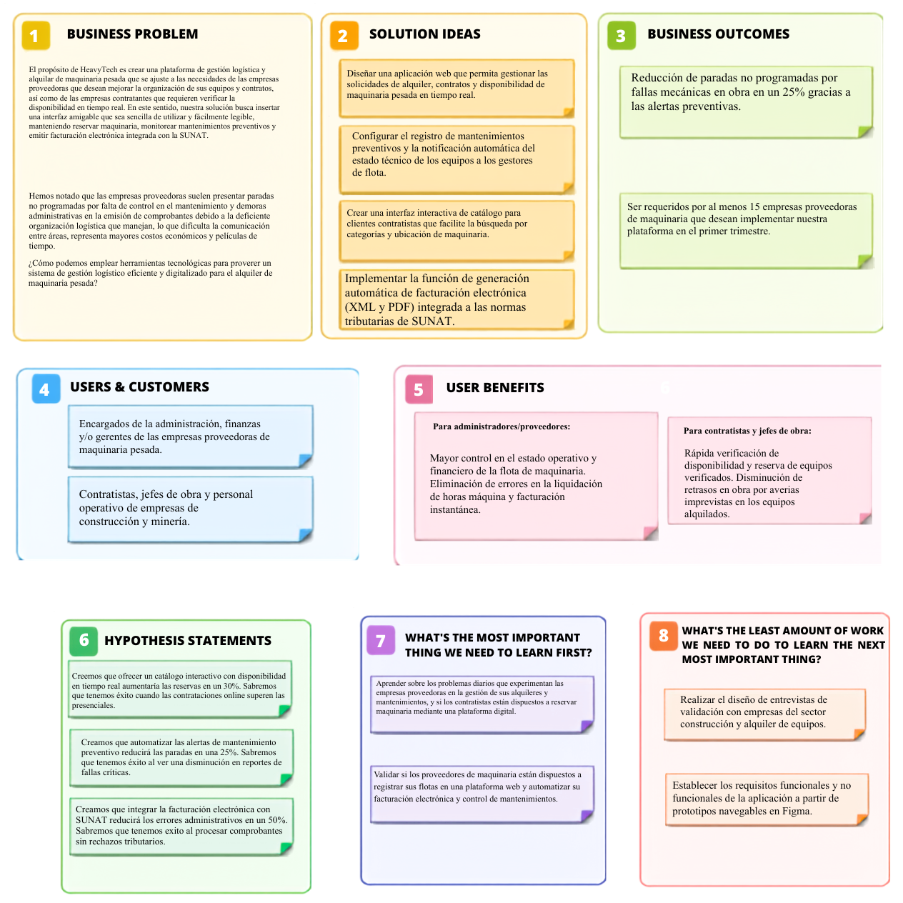
*Ver el lienzo del Lean UX Canvas en [Canva](https://canva.link/k7s7r8rxw4h0cae).*

### 1.3 Segmentos objetivo

Para el desarrollo y validación de MaquiControl se han definido dos segmentos objetivo relacionados directamente con la contratación y gestión de maquinaria pesada. La selección considera tanto su relación con la problemática identificada como la posibilidad de acceder a representantes reales durante las etapas de investigación y validación del producto.

#### Segmento 1: Propietarios y administradores de pequeñas empresas de alquiler de maquinaria

- **Descripción del segmento:** Personas responsables de pequeñas empresas o negocios dedicados al alquiler de maquinaria y equipos para construcción. Administran la disponibilidad de sus equipos, coordinan reservas con clientes, realizan seguimiento de mantenimientos y controlan pagos y contratos.

- **Edad:** Aproximadamente entre 25 y 55 años.
- **Ubicación geográfica:** Principalmente Lima Metropolitana y otras ciudades con actividad de construcción.
- **Rol:** Propietarios, administradores, encargados de operaciones o responsables de alquiler.
- **Uso de tecnología:** Utilizan smartphones, WhatsApp, llamadas telefónicas, hojas de cálculo y otras herramientas básicas para coordinar alquileres y registrar información.
- **Necesidades principales:** Controlar la disponibilidad de la maquinaria, evitar cruces de reservas, registrar mantenimientos y centralizar la información de clientes y alquileres.

#### Segmento 2: Contratistas independientes y responsables de pequeñas obras de construcción

- **Descripción del segmento:** Personas que realizan o supervisan proyectos de construcción y que necesitan alquilar maquinaria o equipos durante determinadas etapas de una obra. Este grupo puede incluir contratistas independientes, maestros de obra, supervisores y pequeños empresarios del sector construcción.

- **Edad:** Aproximadamente entre 25 y 55 años.
- **Ubicación geográfica:** Lima Metropolitana y zonas urbanas con alta actividad de construcción.
- **Rol:** Contratistas independientes, maestros de obra, supervisores o responsables de pequeñas empresas constructoras.
- **Uso de tecnología:** Utilizan principalmente smartphones, WhatsApp, redes sociales y búsquedas en Internet para contactar proveedores y coordinar servicios.
- **Necesidades principales:** Encontrar maquinaria disponible rápidamente, conocer precios y características, coordinar fechas de alquiler y contar con información clara sobre el estado de su solicitud.
# Capítulo II: Requirements Elicitation & Analysis

## 2.1 Competidores
En esta sección se identifican y describen los principales competidores de MaquiControl, considerando soluciones digitales que ofrecen funcionalidades relacionadas con la gestión, alquiler y control de maquinaria. El análisis permite conocer sus principales características, fortalezas y debilidades, con el fin de identificar oportunidades de diferenciación para nuestra propuesta de valor.

### 2.1.1 Análisis competitivo

### Competitive Analysis Landscape

**¿Por qué llevar a cabo este análisis?**  
*¿De qué manera MaquiControl puede diferenciarse de las soluciones de alquiler de maquinaria pesada locales e internacionales mediante una plataforma SaaS integral que unifique la gestión operativa de flota, la programación preventiva de mantenimientos y la facturación electrónica instantánea compatible con SUNAT?*

| Sección | Criterio / Perfil | Su startup: **MaquiControl (AndesHeavyTech)** | Competidor 1: **RentaFacil / Portales Locales** | Competidor 2: **EquipmentShare** | Competidor 3: **Gestión Manual / Excel** |
| :--- | :--- | :--- | :--- | :--- | :--- |
| **Perfil** | **Overview** | Plataforma SaaS integral para la gestión, reserva, mantenimiento preventivo y facturación electrónica de maquinaria pesada. | Portales web de directorio, anuncios clasificados y empresas tradicionales de alquiler local. | Plataforma internacional avanzada de telemetría, rastreo GPS y gestión de flota para construcción. | Control interno informal ejecutado en hojas de cálculo, cuadernos y mensajería instantánea. |
| **Perfil** | **Ventaja competitiva / ¿Qué valor ofrece a los clientes?** | Unificación en un solo flujo digital del alquiler, control técnico de mantenimiento y emisión automática de facturas SUNAT. Transparencia y eliminación de tiempos muertos. | Presencia local previa y red de contactos directos. Contacto rápido vía telefónica o WhatsApp para cotizaciones puntuales. | Telemetría IoT avanzada y alta escala internacional. Control preciso de activos mediante hardware especializado y sensores en tiempo real. | Cero costo directo de software e implementación inmediata. Flexibilidad absoluta en la anotación empírica de datos. |
| **Perfil de Marketing** | **Mercado objetivo** | PYMEs de alquiler de maquinaria y pequeños/medianos contratistas en Perú y Latinoamérica. | Empresas de construcción y contratistas independientes que buscan equipamiento urgente. | Grandes corporaciones de construcción, minería e infraestructura masiva en EE.UU./Global. | Maestros de obra, contratistas independientes y microproveedores informales. |
| **Perfil de Marketing** | **Estrategias de marketing** | Inbound marketing B2B, alianzas con gremios de construcción (CAPECO) y prueba gratuita SaaS. | Anuncios pagados en redes sociales, clasificados impresos/web y prospección telefónica. | Marketing corporativo B2B, eventos de la industria pesada y fuerza de ventas directa. | Recomendación boca a boca (*Word of Mouth*) y redes de contactos personales. |
| **Perfil de Producto** | **Productos & Servicios** | Catálogo interactivo, motor de reservas, alertas de mantenimiento y facturación XML/PDF. | Listado estático de equipos, formulario de contacto y cotización bajo solicitud. | Rastreo GPS, diagnóstico de motores, control de activos y portal de alquiler corporativo. | Planillas de Excel editables, cuadernos de campo y comprobantes en portal externo. |
| **Perfil de Producto** | **Precios & Costos** | Suscripción mensual/anual por tamaño de flota + comisión por transacción de alquiler. | Cotizaciones variables según negociación directa, volumen y duración del servicio. | Suscripción Enterprise de alto costo + tarifas corporativas de arrendamiento. | Sin costo de software (cubierto por licencias estándar de ofimática o papel). |
| **Perfil de Producto** | **Canales de distribución (Web y/o Móvil)** | Aplicación Web Progresiva (PWA) accesible desde navegadores web y dispositivos móviles. | Sitio web informativo, llamadas telefónicas directas y mensajería vía WhatsApp. | Plataforma web Enterprise y aplicación móvil nativa (iOS / Android). | Archivos locales de computadora, hojas impresas y carpetas físicas. |
| **Análisis SWOT** | **Fortalezas** | • Plataforma SaaS All-In-One (alquiler, mantenimiento, SUNAT). • Interfaz responsiva intuitiva. • Automatización de alertas preventivas. | • Posicionamiento de marca local. • Confianza por relaciones comerciales previas. | • Tecnología IoT y telemetría de vanguardia. • Respaldo de grandes capitales. | • Cero costo de software. • Familiaridad total de uso. |
| **Análisis SWOT** | **Debilidades** | • Marca nueva en el mercado peruano. • Dependencia de la adopción tecnológica inicial. | • Proceso de reserva estático y manual. • Sin gestión interna de mantenimiento. | • Costos inaccesibles para PYMEs. • Sin localización tributaria SUNAT. | • Alto riesgo de pérdida de datos y sobreventa. • Sin alertas ni análisis en tiempo real. |
| **Análisis SWOT** | **Oportunidades** | • Exigencia de formalización SUNAT. • Insatisfacción por averías imprevistas. | • Migración digital mediante alianzas. | • Captura de sector minero corporativo. | • Gran volumen de mercado por digitalizar. |
| **Análisis SWOT** | **Amenazas** | • Resistencia al cambio informal. • Entrada de competidores globales. | • Pérdida de cuota ante plataformas en tiempo real. | • Barreras normativas en LATAM. | • Perpetuación de la informalidad. |

---

### 2.1.2 Estrategias y tácticas frente a competidores
A partir del análisis FODA cruzado, MaquiControl aplicará las siguientes estrategias y tácticas preliminares:

1. **Estrategia de Penetración de Mercado vs. Gestión Manual (Excel/WhatsApp):**
    * *Táctica:* Ofrecer una prueba gratuita (*Free Trial*) de 30 días acompañada de una plantilla de migración asistida, demostrando la reducción del 50% en tiempo administrativo y la eliminación de cruces de reservas desde la primera semana.
2. **Estrategia de Diferenciación vs. Portales Locales Tradicionales:**
    * *Táctica:* Promover la funcionalidad de **Catálogo Dinámico con Disponibilidad Garantizada en Tiempo Real** e integración instantánea con **Facturación Electrónica SUNAT**, posicionando a MaquiControl no solo como un directorio, sino como el sistema operativo del negocio de alquiler.
3. **Estrategia de Costo-Efectividad vs. Competidores Internacionales (EquipmentShare):**
    * *Táctica:* Comercializar una solución SaaS *cloud-native* sin necesidad de instalación de hardware costoso en etapas iniciales, ofreciendo planes de suscripción adaptados a la cantidad de máquinas de la PYME (desde 1 hasta 20 equipos).
4. **Estrategia de Mitigación de Amenazas Operativas:**
    * *Táctica:* Implementar un módulo de **Historial Técnico Certificado** que otorgue un "Sello de Mantenimiento al Día" a las máquinas registradas, incrementando la confianza de los contratistas y justificando tarifas de alquiler más competitivas.

## 2.2 Entrevistas
En esta sección se desarrolla el proceso de recolección de información mediante entrevistas dirigidas a representantes de los segmentos objetivo definidos para MaquiControl. El propósito es conocer sus experiencias, necesidades, problemas y comportamientos relacionados con el alquiler y gestión de maquinaria, de modo que los hallazgos obtenidos sirvan como base para el análisis de requerimientos y la posterior construcción de los User Personas y demás artefactos de Needfinding.

### 2.2.1 Diseño de entrevistas
Para la recolección de requerimientos se diseñaron guías de entrevista breves y estructuradas de 8 preguntas clave por segmento objetivo. Estas combinan datos demográficos/tecnológicos para el perfilamiento de arquetipos (*User Personas*) con preguntas profundas sobre la problemática operativa y de negocio.

### Segmento 1: Propietarios y administradores de empresas de alquiler de maquinaria

1. **¿Cuál es su nombre, edad, cargo, dispositivos y aplicaciones que utiliza a diario para administrar su negocio?** *(Complementaria)*
2. **¿Qué marcas o proveedores prefiere y qué fuentes consulta antes de tomar decisiones operativas?** *(Complementaria)*
3. **¿Cómo gestiona actualmente el inventario, la disponibilidad y los mantenimientos de su flota?** *(Principal)*
4. **¿Qué sucede cuando una máquina sufre una avería inesperada en obra y cómo gestiona las pérdidas?** *(Principal)*
5. **¿Cómo realiza la conciliación de horas trabajadas y la emisión de facturas electrónicas (SUNAT)?** *(Principal)*
6. **¿Cuáles son sus principales objetivos o prioridades dentro de su trabajo diario? (Complementaria)**
7. **¿Qué situaciones relacionadas con el alquiler o gestión de maquinaria le generan mayor frustración? (Complementaria)**
8. **¿Qué aplicaciones, páginas web o herramientas digitales utiliza con mayor frecuencia para trabajar y comunicarse? (Complementaria)**

### Segmento 2: Contratistas independientes y responsables de obras de construcción

1. **¿Cuál es su nombre, edad, cargo, nivel educativo y qué dispositivos/navegadores utiliza en obra?** *(Complementaria)*
2. **¿A través de qué canales o influencias del sector busca y contrata proveedores de maquinaria?** *(Complementaria)*
3. **¿Qué dificultades encuentra respecto a la transparencia de tarifas y la disponibilidad real de los equipos?** *(Principal)*
4. **¿Ha experimentado paradas de obra por fallas mecánicas en maquinaria alquilada? ¿Cómo afectó sus costos?** *(Principal)*
5. **¿Cómo valida el conteo de horas trabajadas y qué exige en una plataforma digital para reservar maquinaria?** *(Principal)*
6. **¿Cuáles son sus principales objetivos o prioridades dentro de su trabajo diario? (Complementaria)**
7. **¿Qué situaciones relacionadas con el alquiler o gestión de maquinaria le generan mayor frustración? (Complementaria)**
8. **¿Qué aplicaciones, páginas web o herramientas digitales utiliza con mayor frecuencia para trabajar y comunicarse? (Complementaria)**

### 2.2.2 Registro de entrevistas

En esta sección se presentan las entrevistas realizadas a representantes de los segmentos objetivo de MaquiControl. Cada entrevista permite recopilar información sobre sus experiencias, necesidades, problemas y hábitos relacionados con la gestión y alquiler de maquinaria. Los resultados obtenidos servirán como base para el análisis de entrevistas y la construcción de los artefactos de Needfinding.

#### Segmento 1: Propietarios y administradores de pequeñas empresas de alquiler de maquinaria

##### Entrevista 1

- **Nombre y apellidos:** José Ramírez
- **Edad:** 27
- **Distrito:** Comas
- **Ocupacion:** Director de una pequeña empresa dedicada al alquiler de maquinaria
- **Timing en el video:**

**Captura de la entrevista:**

**Resumen de la entrevista:**

José Ramírez dirige una pequeña empresa dedicada al alquiler de maquinaria y utiliza principalmente un teléfono Android y una laptop con navegador Chrome para realizar sus actividades laborales. Para coordinar con clientes y trabajadores utiliza principalmente WhatsApp y llamadas telefónicas, mientras que Excel le permite llevar algunos registros relacionados con el negocio.

Para encontrar proveedores de maquinaria, suele recurrir a recomendaciones de otros contratistas y contactos del sector. También utiliza WhatsApp, Google, Facebook y páginas web de empresas para comparar diferentes alternativas antes de tomar una decisión.

Uno de los principales problemas que identifica en el proceso de alquiler es la falta de transparencia en las tarifas, debido a que algunos precios pueden variar dependiendo del tiempo de uso o del costo del transporte. Asimismo, ha experimentado situaciones en las que una máquina supuestamente disponible finalmente se encontraba alquilada o en mantenimiento.

Respecto a las fallas mecánicas, indicó que en una ocasión una avería provocó aproximadamente un día de retraso en una obra. La espera por la llegada del técnico ocasionó que parte del personal permaneciera inactivo y que el cronograma se viera afectado, incrementando los costos de la operación.

El control de las horas trabajadas se realiza en coordinación con el operador y el encargado de la obra. En una futura plataforma digital, considera importante poder consultar claramente las horas registradas, el precio del alquiler, la disponibilidad y el estado de la maquinaria, además de recibir un comprobante de la reserva.

Sus principales prioridades son garantizar la disponibilidad de la maquinaria, reducir retrasos y mantener un adecuado control de costos. Entre sus principales frustraciones se encuentran la falta de información clara, las fallas inesperadas de los equipos y las demoras en las entregas.

##### Entrevista 2

- **Nombre y apellidos:** Carlos Stephano Mendoza
- **Edad:** 52 años
- **Ocupación:** Encargado de operaciones en un pequeño negocio de alquiler de maquinaria
- **Distrito:** San Juan de Lurigancho
- **Timing en el video:**

**Captura de la entrevista:**

**Resumen de la entrevista:**

Stephano Mendoza se desempeña como encargado de operaciones en un pequeño negocio dedicado al alquiler de maquinaria. Para realizar sus actividades utiliza principalmente un teléfono celular y una computadora de escritorio. Su navegador habitual es Google Chrome y emplea WhatsApp para coordinar con clientes y trabajadores.

Para seleccionar proveedores, generalmente recurre a empresas o personas con las que ya ha trabajado anteriormente o que han sido recomendadas por otros empresarios del sector. También realiza búsquedas mediante Google y consulta grupos de Facebook relacionados con construcción y maquinaria.

Entre los problemas que encuentra durante el proceso de alquiler destaca la falta de claridad en los precios, debido a que algunas cotizaciones no incluyen inicialmente costos adicionales como transporte o combustible. También ha experimentado situaciones en las que una máquina aparecía como disponible, pero ya había sido reservada por otro cliente.

Las fallas mecánicas representan otra dificultad frecuente. Cuando una máquina presenta una avería, debe esperar la llegada de un técnico y, en caso de que la reparación tome demasiado tiempo, buscar un equipo alternativo. Esto puede ocasionar pérdidas de tiempo, gastos adicionales de transporte y problemas en el cumplimiento de los compromisos asumidos con los clientes.

Para validar las horas trabajadas, compara la información del horómetro de la máquina con el reporte entregado por el operador. En una plataforma digital de alquiler considera importante poder consultar el historial de uso de la maquinaria, el precio por hora, las fechas disponibles y recibir una confirmación formal de la reserva.

Sus principales prioridades son mantener las máquinas operativas, cumplir con los plazos acordados con los clientes y reducir los tiempos muertos. Sus mayores frustraciones están relacionadas con cambios de último momento, máquinas que dejan de estar disponibles pese a haber sido coordinadas previamente y problemas en el registro de los mantenimientos.

Entre las herramientas digitales que utiliza con mayor frecuencia se encuentran WhatsApp, Excel, Gmail, Google Maps, páginas web de proveedores y Facebook Marketplace.
Segmento 2: Contratistas independientes y responsables de obras de construcción
Entrevista 1

##### Entrevista 3

- **Nombre y apellidos:** Andrea López
- **Edad:** 30 años
- **Ocupación:** Administradora de una empresa familiar de alquiler de maquinaria
- **Distrito:** Surco
- **Timing en el video:**

**Captura de la entrevista:**

**Resumen de la entrevista:**

Andrea López, administradora de 30 años de una pequeña empresa familiar dedicada al alquiler de maquinaria, señala que actualmente la gestión del negocio se realiza principalmente mediante WhatsApp y hojas de cálculo de Excel. Esta forma de trabajo genera dificultades para mantener actualizada la información sobre disponibilidad, reservas y mantenimiento de los equipos.

Uno de los principales problemas identificados es el cruce de fechas de alquiler, provocado por la falta de actualización o comunicación entre las personas encargadas. También menciona situaciones en las que se ofrece una máquina que posteriormente resulta estar en mantenimiento. Para Andrea, sería especialmente útil contar con una plataforma que centralice la información del negocio y permita consultar rápidamente el estado de cada equipo.

La entrevistada considera indispensable disponer de un calendario de disponibilidad y valora que la plataforma pueda utilizarse fácilmente desde un teléfono móvil. Asimismo, destaca que una solución sencilla, clara y con pocos pasos facilitaría su adopción.

#### Segmento 2: Contratistas independientes y responsables de obras de construcción

##### Entrevista 1

- **Nombre y apellidos:** Harold Angello
- **Edad:** 41 años
- **Ocupación:** Ingeniero civil y propietario de una pequeña constructora
- **Obras supervisadas:** Entre 2 y 3 obras simultáneamente
- **Dispositivos y navegador:** iPhone en obra; laptop con Google Chrome en oficina.

**Resumen de la entrevista:**

Harold Angello es ingeniero civil y dirige una pequeña constructora. Supervisa entre dos y tres obras de forma simultánea. En campo utiliza principalmente su iPhone, mientras que en la oficina revisa cotizaciones y correos desde una laptop con Google Chrome.

Para buscar maquinaria, primero contacta a proveedores de confianza. Cuando requiere equipos nuevos o especializados, realiza búsquedas en Google, revisa reseñas y solicita recomendaciones en grupos de WhatsApp de colegas ingenieros.

Su principal dificultad es la falta de disponibilidad real de las máquinas: algunos proveedores confirman equipos que luego ya fueron comprometidos con otras obras. Asimismo, las fallas mecánicas generan paradas de obra, costos por tiempos muertos y retrasos que afectan el cumplimiento de los plazos acordados con sus clientes.

Actualmente, los encargados de cada obra reportan las horas trabajadas por WhatsApp al finalizar el día. En una plataforma digital, Harold espera visualizar en un solo lugar el estado de las reservas y los equipos asignados a todas sus obras.

Sus principales prioridades son evitar que las obras se detengan por falta de maquinaria y cumplir los plazos comprometidos con sus clientes. Sus mayores frustraciones son las dobles reservas, las fallas mecánicas y la falta de visibilidad centralizada de sus equipos. Utiliza WhatsApp, Gmail, Google Calendar y Microsoft Excel como herramientas de trabajo.

##### Entrevista 2

- **Nombre y apellidos:** Renzo Huamán
- **Edad:** 38 años
- **Ocupación:** contratista independiente
- **Obras supervisadas:** Entre 2 y 3 obras simultáneamente
- **Dispositivos y navegador:** Celular y laptop con google en la oficina, ademas de exel.

**Resumen de la entrevista:**

Renzo Huamán es un contratista de 38 años con formación en construcción civil, habituado a operar con su teléfono en obra y una laptop en oficina. Para sus tareas diarias se apoya en WhatsApp, Facebook, Google Maps y Excel, gestionando sus proyectos con el objetivo principal de evitar tiempos muertos, controlar los costos y cumplir estrictamente los cronogramas pactados con sus clientes.

Al buscar maquinaria, prioriza las recomendaciones de colegas sobre las búsquedas en internet, pero enfrenta constantes fricciones con los proveedores tradicionales. Sus mayores frustraciones radican en la falta de transparencia en las tarifas —con cargos imprevistos de flete u operador—, la falsa disponibilidad que deja la obra sin equipo, y las averías mecánicas que paralizan la jornada generando sobrecostos por mano de obra inactiva.

Para solucionar estos problemas y reemplazar el control manual que lleva en su cuaderno de obra, Renzo adoptaría una plataforma digital siempre que ofrezca precios finales transparentes por hora, garantía de disponibilidad en tiempo real y un comprobante formal que respalde cada reserva.

### 2.2.3 Análisis de entrevistas

#### Análisis preliminar del Segmento 1

El Segmento 1 está compuesto por propietarios y administradores de pequeñas empresas de alquiler de maquinaria, quienes tienen la responsabilidad de coordinar la disponibilidad de equipos, atender solicitudes de clientes, gestionar reservas y supervisar el mantenimiento.

El proceso actual suele depender de herramientas independientes como WhatsApp, llamadas telefónicas, hojas de cálculo y registros manuales. Esto provoca que la información se encuentre dispersa y que los responsables tengan que consultar varias fuentes antes de confirmar un alquiler.

Los principales problemas identificados en este segmento son el cruce de reservas, la dificultad para conocer la disponibilidad real de la maquinaria, la falta de información actualizada sobre mantenimiento y la pérdida de tiempo al buscar información entre diferentes medios. También existe el riesgo de comprometer un equipo que ya está reservado o fuera de servicio.

A partir de estas necesidades, el segmento requiere principalmente una solución que permita centralizar la gestión de la flota. Las funcionalidades de mayor valor serían un calendario de disponibilidad, control de reservas, seguimiento del mantenimiento, registro del estado de los equipos y acceso rápido a la información de cada alquiler.

Otro aspecto relevante es la movilidad. Debido a que administradores y propietarios pueden atender el negocio fuera de una oficina, el acceso desde teléfonos móviles resulta importante. Por ello, MaquiControl debe ofrecer una interfaz responsive que permita consultar y actualizar información desde diferentes dispositivos.

También se observa que la facilidad de uso puede ser determinante para la adopción. Estos usuarios no necesariamente buscan un sistema complejo, sino una herramienta que reduzca pasos, presente la información de manera clara y sustituya parte de la coordinación manual que actualmente realizan por WhatsApp y Excel.

En consecuencia, la principal oportunidad para MaquiControl dentro de este segmento consiste en ofrecer un punto único de control de la operación, permitiendo conocer rápidamente qué maquinaria está disponible, reservada o en mantenimiento y mantener un registro organizado de las operaciones.

Principales necesidades detectadas: disponibilidad de maquinaria en tiempo real, prevención de conflictos entre reservas, control de mantenimiento, centralización de información, acceso desde dispositivos móviles y una interfaz sencilla.

Pain points principales: información dispersa, actualizaciones manuales, errores de coordinación, demora al responder a clientes, riesgo de reservas duplicadas y dificultad para conocer el estado real de los equipos.

Oportunidad para MaquiControl: reducir la dependencia de hojas de cálculo y conversaciones dispersas mediante una plataforma centralizada que permita administrar la flota, las reservas y el mantenimiento de forma más organizada.

#### Análisis preliminar del Segmento 2

La entrevista realizada evidencia que los contratistas y responsables de obra necesitan información confiable y centralizada para coordinar maquinaria en múltiples proyectos simultáneamente. La disponibilidad inexacta y las dobles reservas representan el principal riesgo operativo, ya que pueden detener una obra y afectar directamente los costos y plazos de entrega.

También se identificó la necesidad de registrar y validar las horas trabajadas de cada equipo, actualmente reportadas de forma manual mediante WhatsApp. Por ello, una plataforma digital debe permitir consultar reservas, disponibilidad, estado de la maquinaria y horas trabajadas desde un único panel.

Principales necesidades detectadas: visibilidad centralizada de reservas y equipos en múltiples obras simultáneas, confirmación confiable de disponibilidad, registro digital de horas trabajadas y acceso desde dispositivos móviles.

Pain points principales: dobles reservas por parte de proveedores, paradas de obra por fallas mecánicas imprevistas, y dispersión de la información de horas trabajadas entre distintos chats de WhatsApp.

Oportunidad para MaquiControl: ofrecer un panel único donde el contratista pueda supervisar el estado de reservas, disponibilidad y avance de maquinaria en todas sus obras a la vez, reduciendo la dependencia de coordinación manual por WhatsApp.

## 2.3 Needfinding

En esta sección se presentan los principales artefactos obtenidos a partir del análisis de la información recolectada durante las entrevistas y el estudio de los segmentos objetivo. El proceso de Needfinding permite identificar las necesidades, comportamientos, objetivos y dificultades de los usuarios, sirviendo como base para la elaboración de los User Personas, User Task Matrix, User Journey Maps y Empathy Maps.

En esta sección se presentan los artefactos resultantes del proceso de análisis de la información recolectada durante las entrevistas y el análisis competitivo. A partir de las características objetivas y subjetivas identificadas en los segmentos objetivo, se construyeron los User Personas, el User Task Matrix, los User Journey Maps (versión As-Is) y los Empathy Maps correspondientes a cada arquetipo, utilizando la herramienta UXPressia.

### 2.3.1 User Personas

Los User Personas representan arquetipos construidos a partir de la información recopilada durante las entrevistas y el análisis de los segmentos objetivo. Estos perfiles permiten sintetizar características, necesidades, objetivos, motivaciones y frustraciones comunes de los usuarios, sirviendo como base para los siguientes artefactos del proceso de Needfinding.

#### Segmento 1: Propietarios y administradores de pequeñas empresas de alquiler de maquinaria

A partir de las entrevistas realizadas al primer segmento objetivo, se identificaron patrones relacionados con la gestión de disponibilidad de maquinaria, control de costos, coordinación con clientes, mantenimiento de equipos y uso de herramientas digitales. Estos hallazgos fueron utilizados para construir el siguiente User Persona.

##### Luis Herrera

Luis Herrera representa al administrador de una pequeña empresa dedicada al alquiler de maquinaria. Su perfil refleja las principales características, necesidades, objetivos y frustraciones identificadas en las entrevistas realizadas al segmento.

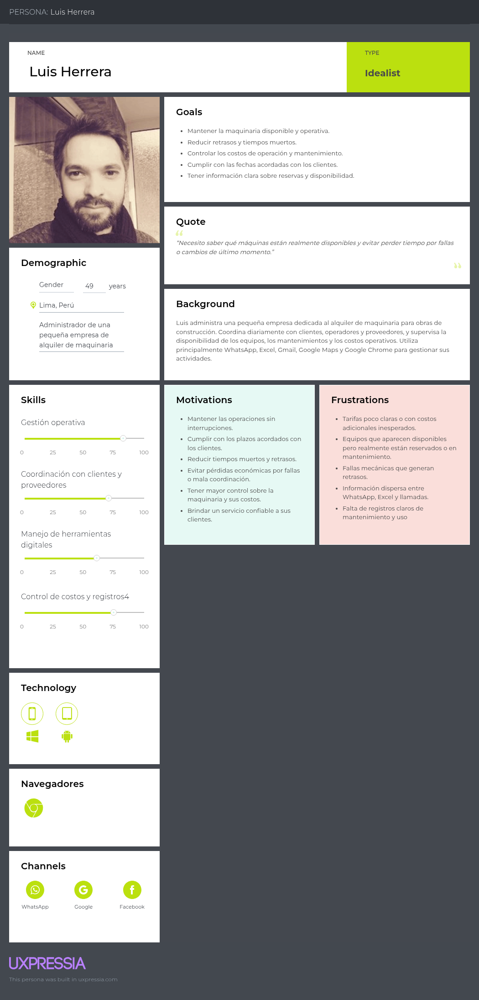

#### Segmento 2: Contratistas independientes y responsables de obras de construcción

A partir de la entrevista realizada a Harold Angello, se identificaron necesidades relacionadas con la disponibilidad confiable de maquinaria, el control centralizado de reservas y la continuidad operativa de varias obras simultáneas.

##### Harold Angello

Harold Angello representa al contratista responsable de pequeñas obras que necesita asegurar maquinaria disponible y mantener el control operativo de sus proyectos.

##### Renzo Huaman
Renzo Huamán representa al contratista independiente que supervisa varias obras y requiere información confiable sobre disponibilidad de maquinaria, tarifas transparentes y registro digital de horas trabajadas.

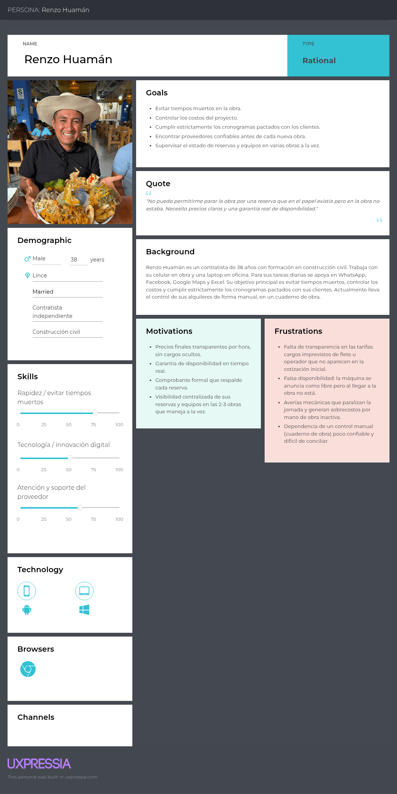

### 2.3.2 User Task Matrix

| Tarea (Task) | Luis Herrera — Frecuencia | Luis Herrera — Importancia | Renzo Huamán — Frecuencia | Renzo Huamán — Importancia |
| :--- | :---: | :---: | :---: | :---: |
| Verificar disponibilidad real de una máquina | Alta | Alta | Alta | Alta |
| Coordinar reservas con clientes/proveedores vía WhatsApp o llamada | Alta | Alta | Alta | Media |
| Registrar/controlar el estado de mantenimiento de los equipos | Alta | Alta | Baja | Media |
| Cotizar y comparar precios de alquiler entre proveedores | Media | Alta | Alta | Alta |
| Gestionar imprevistos por fallas mecánicas en obra | Media | Alta | Media | Alta |
| Validar y conciliar las horas trabajadas de la maquinaria | Alta | Media | Media | Media |
| Emitir o recibir comprobantes/facturas del servicio | Media | Media | Baja | Media |
| Buscar referencias o recomendaciones de proveedores | Baja | Media | Media | Alta |

**Análisis:** la tarea con mayor frecuencia e importancia compartida por ambos User Persona es **verificar la disponibilidad real de la maquinaria**, lo cual confirma que la disponibilidad poco confiable es el dolor central identificado en ambos segmentos Luis Herrera, al administrar la flota, prioriza con mayor frecuencia e importancia el control del mantenimiento, tarea que para Renzo Huamán es secundaria, pues él consume el servicio en vez de administrarlo. En cambio, Renzo le da mayor peso a cotizar y comparar precios y a buscar recomendaciones, dado que su rol implica seleccionar proveedores para cada nueva obra. Ambos coinciden en la relevancia alta de gestionar imprevistos por fallas mecánicas, reflejando que este riesgo operativo afecta a toda la cadena, tanto a quien alquila como a quien administra la flota.

### 2.3.3 User Journey Mapping

El siguiente User Journey Map representa el proceso actual seguido por el User Persona Luis Herrera para gestionar el alquiler de maquinaria, desde la recepción de una solicitud hasta el cierre del servicio. El recorrido muestra sus principales acciones, canales utilizados, problemas, emociones y oportunidades de mejora en el contexto actual, sin considerar todavía la solución MaquiControl.

El siguiente User Journey Map representa el proceso actual seguido por Harold Angello para buscar, reservar y supervisar maquinaria en sus obras.

### 2.3.4. Empathy Mapping

A continuación se presentan los Empathy Mapping de los segmentos objetivos de MaquiControl.

### Segmento 1: Propietarios y administradores de pequeñas empresas de alquiler de maquinaria

El siguiente Empathy Map representa a Luis Herrera, User Persona del Segmento 1. El artefacto sintetiza los principales comportamientos, necesidades, frustraciones, pensamientos y expectativas identificados a partir de las entrevistas realizadas a usuarios pertenecientes a este segmento.

#### Segmento 2: Contratistas independientes y responsables de obras de construcción

| Cuadrante | Descripción y Hallazgos Clave |
| :--- | :--- |
| **¿Qué piensa y siente?** | Piensa en cómo coordinar la logística de sus 2 a 3 obras simultáneas sin paradas. Siente frustración por la doble reserva de equipos y ansiedad por no retrasar los plazos acordados con los clientes. |
| **¿Qué ve?** | Ve paradas de obra por averías mecánicas imprevistas, falta de transparencia en las tarifas finales y reportes diarios de horas recibidos por WhatsApp. |
| **¿Qué escucha?** | Escucha recomendaciones de proveedores en grupos de WhatsApp de ingenieros, promesas incumplidas de stock por parte de alquiladores y reclamos por retrasos en obra. |
| **¿Qué dice y hace?** | Exige visibilidad de todos sus equipos en un solo lugar centralizado. Cotiza proveedores por Google o WhatsApp y transcribe reportes de horas a hojas de Excel en su laptop. |
| **Ganancias (Gains)** | Disponibilidad garantizada en tiempo real, cumplimiento estricto de los plazos de entrega y supervisión centralizada multi-obra de alquileres y costos. |
| **Dolores (Pains)** | Doble reserva de maquinaria por proveedores poco éticos, paradas de obra por fallas mecánicas y dispersión de datos entre múltiples chats de WhatsApp y hojas de cálculo. |
## 2.4 Big Picture Event Storming

El Big Picture Event Storming de MaquiControl fue elaborado con el objetivo de representar de manera visual los principales procesos, eventos, actores, reglas de negocio y problemas identificados dentro del dominio de alquiler y gestión de maquinaria pesada. El análisis toma como base la problemática definida en el proyecto, las entrevistas realizadas, los User Personas, el User Task Matrix y los principales hallazgos del proceso de Needfinding.

Durante la sesión se identificaron eventos relacionados con la búsqueda y disponibilidad de maquinaria, gestión de reservas, control de flota, mantenimiento, ejecución del servicio, validación de horas trabajadas, facturación electrónica, suscripciones, alertas operativas y visualización de información mediante dashboards.

Asimismo, se identificaron hotspots relevantes como las reservas duplicadas, información de disponibilidad desactualizada, fallas mecánicas inesperadas, dispersión de información entre WhatsApp y Excel, discrepancias en el registro de horas trabajadas y retrasos en la facturación. Estos hallazgos permiten comprender el dominio de negocio a alto nivel y sirven como base para posteriores actividades de modelado mediante Domain-Driven Design.

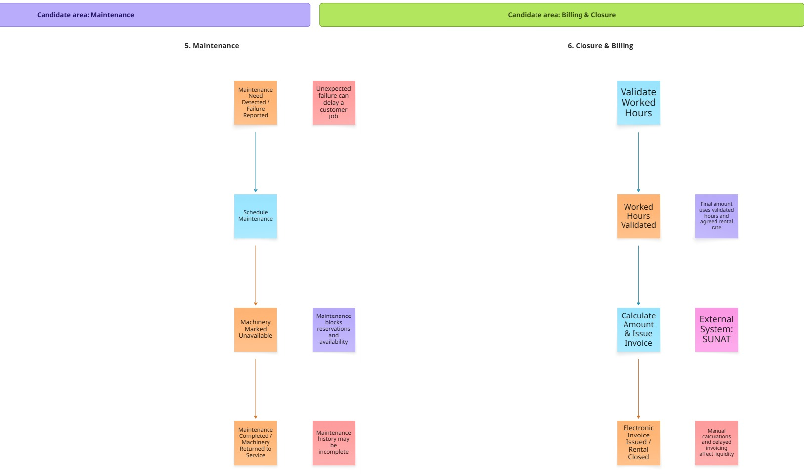
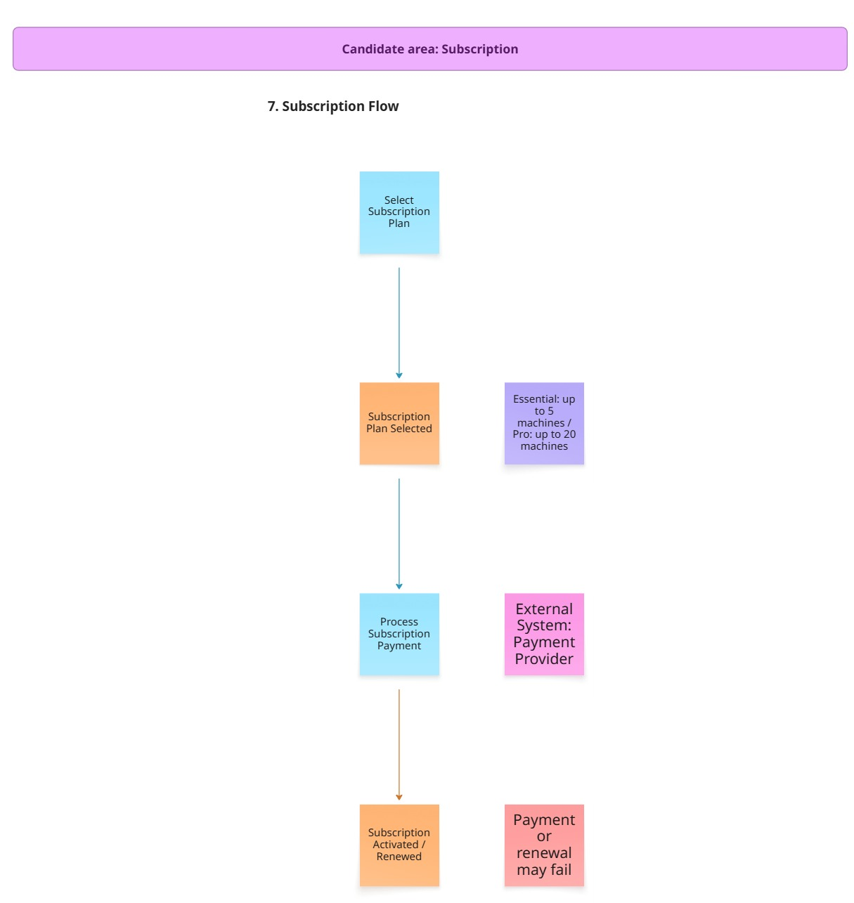
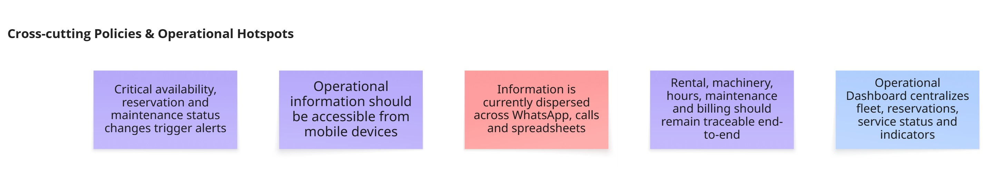

A partir del mapa se reconocen áreas de dominio candidatas como Discovery and Availability, Rental and Reservation Management, Fleet and Maintenance Management, Service Execution and Hour Control, Subscription Management, Billing and SUNAT Compliance, Operational Notifications y Dashboard and Analytics. Estas áreas todavía no representan Bounded Contexts definitivos, ya que su refinamiento se realizará posteriormente mediante Design-Level Event Storming.

## 2.5 Ubiquitous Language

El Ubiquitous Language de MaquiControl reúne los principales términos utilizados dentro del dominio de alquiler y gestión de maquinaria. Su propósito es establecer un vocabulario común entre los miembros del equipo y los stakeholders, evitando ambigüedades durante el análisis, diseño y desarrollo de la solución.

| Term | Definition |
|------|------------|
| **Machinery (Maquinaria)** | Equipo o máquina pesada utilizada para realizar trabajos de construcción, movimiento de tierra u otras actividades similares, y que puede ser ofrecida en alquiler. |
| **Fleet (Flota)** | Conjunto de máquinas administradas por una empresa de alquiler de maquinaria. |
| **Machinery Owner (Propietario de maquinaria)** | Persona o empresa responsable de una o más máquinas ofrecidas para alquiler. |
| **Fleet Administrator (Administrador de flota)** | Persona encargada de supervisar la disponibilidad, reservas, estado operativo y mantenimiento de una flota de maquinaria. |
| **Contractor (Contratista)** | Persona o empresa que requiere maquinaria para realizar trabajos o proyectos y que puede solicitar su alquiler. |
| **Site Manager (Responsable de obra)** | Persona encargada de coordinar actividades en una obra y verificar los recursos necesarios, incluyendo maquinaria. |
| **Machinery Catalog (Catálogo de maquinaria)** | Conjunto organizado de máquinas disponibles para consulta por parte de potenciales clientes. |
| **Machinery Availability (Disponibilidad de maquinaria)** | Estado que indica si una máquina puede ser alquilada durante un periodo determinado. |
| **Rental Request (Solicitud de alquiler)** | Solicitud realizada por un contratista para alquilar una maquinaria específica en determinadas fechas. |
| **Quotation (Cotización)** | Propuesta que contiene las condiciones y el costo estimado de un alquiler de maquinaria. |
| **Reservation (Reserva)** | Confirmación anticipada mediante la cual una maquinaria queda separada para un cliente y periodo determinados. |
| **Rental (Alquiler)** | Acuerdo mediante el cual una maquinaria es utilizada por un cliente durante un periodo determinado a cambio de un pago. |
| **Rental Period (Periodo de alquiler)** | Intervalo de tiempo durante el cual una maquinaria permanece asignada a un alquiler. |
| **Rental Rate (Tarifa de alquiler)** | Precio establecido para el uso de una maquinaria durante un periodo o cantidad de horas determinada. |
| **Machinery Assignment (Asignación de maquinaria)** | Asociación de una maquinaria específica con un servicio o alquiler confirmado. |
| **Service Execution (Ejecución del servicio)** | Periodo durante el cual la maquinaria se encuentra trabajando para el contratista según las condiciones acordadas. |
| **Worked Hours (Horas trabajadas)** | Cantidad de horas efectivas durante las cuales una maquinaria ha sido utilizada en un servicio. |
| **Hour Validation (Validación de horas)** | Proceso mediante el cual se verifica que las horas registradas de uso de la maquinaria sean correctas antes del cierre del servicio. |
| **Machinery Status (Estado de maquinaria)** | Condición actual de una máquina, por ejemplo disponible, reservada, alquilada o en mantenimiento. |
| **Maintenance (Mantenimiento)** | Actividades preventivas o correctivas realizadas para conservar o recuperar el estado operativo de una maquinaria. |
| **Maintenance Schedule (Programa de mantenimiento)** | Planificación de las fechas o periodos en los que una maquinaria debe recibir mantenimiento. |
| **Mechanical Failure (Falla mecánica)** | Problema técnico que impide o limita el funcionamiento normal de una maquinaria. |
| **Maintenance Record (Registro de mantenimiento)** | Historial de intervenciones, reparaciones y mantenimientos realizados a una maquinaria. |
| **Machinery Return (Devolución de maquinaria)** | Proceso mediante el cual la maquinaria es entregada al propietario después de finalizar el alquiler. |
| **Rental Closure (Cierre de alquiler)** | Finalización formal de un alquiler después de la devolución de la maquinaria, validación de horas y cálculo del monto correspondiente. |
| **Rental Amount (Monto de alquiler)** | Importe económico calculado por el uso de una maquinaria durante el periodo contratado. |
| **Electronic Invoice (Factura electrónica)** | Comprobante electrónico emitido como resultado de una operación de alquiler. |
| **Subscription Plan (Plan de suscripción)** | Modalidad de pago mediante la cual una empresa accede a determinadas funcionalidades y capacidades de MaquiControl. |
| **Essential Plan** | Plan de suscripción orientado a pequeños negocios que administran hasta 5 máquinas. |
| **Pro Plan** | Plan de suscripción orientado a negocios en crecimiento que administran hasta 20 máquinas. |
| **Subscription (Suscripción)** | Relación comercial mediante la cual un usuario mantiene acceso a MaquiControl de acuerdo con un plan contratado. |
| **Service Commission (Comisión de servicio)** | Importe asociado a una operación de alquiler que puede formar parte del modelo de ingresos de MaquiControl. |
| **Operational Alert (Alerta operativa)** | Aviso generado ante cambios relevantes como reservas, mantenimiento, disponibilidad o estado de una máquina. |
| **Operational Dashboard (Panel operativo)** | Vista consolidada que permite conocer el estado de la flota, reservas, alquileres y principales indicadores operativos. |
| **Double Booking (Reserva duplicada)** | Situación no deseada en la que una misma maquinaria es reservada para periodos que se superponen. |

# Capítulo III: Requirements Specification

## 3.1 User Stories
# User Histories - MaquiControl

| Epic / Story ID | Tipo | Título | User Story | Criterios de aceptación | Relacionado con |
|---|---|---|---|---|---|
| EP-01 | Epic | Gestión de maquinaria y disponibilidad | Permitir la administración del inventario, estado y disponibilidad de las maquinarias de alquiler. | El sistema debe permitir registrar, consultar y actualizar la información de las maquinarias. | — |
| US-001 | User Story | Registrar maquinaria | Como propietario de una empresa de alquiler, quiero registrar una maquinaria con sus características, para mantener actualizado el inventario. | **Given:** el propietario tiene permisos de registro. **When:** registra los datos obligatorios de la maquinaria. **Then:** el sistema guarda la maquinaria y la muestra en el inventario. | EP-01 |
| US-002 | User Story | Consultar disponibilidad | Como administrador, quiero consultar la disponibilidad de una maquinaria por fecha, para evitar reservas duplicadas. | **Given:** existe una maquinaria registrada. **When:** el administrador consulta un periodo determinado. **Then:** el sistema muestra si la maquinaria está disponible, reservada o en mantenimiento. | EP-01 |
| US-003 | User Story | Gestionar mantenimiento | Como propietario, quiero actualizar el estado de mantenimiento de una maquinaria, para evitar que sea reservada cuando no está operativa. | **Given:** existe una maquinaria registrada. **When:** el propietario cambia su estado a mantenimiento. **Then:** el sistema impide nuevas reservas durante dicho estado. | EP-01 |
| US-016 | User Story | Editar datos de maquinaria | Como propietario, quiero modificar los datos técnicos de un equipo, para mantener la información actualizada. | **Given:** la maquinaria está registrada. **When:** el propietario actualiza sus especificaciones. **Then:** el sistema guarda los cambios en el catálogo. | EP-01 |
| US-017 | User Story | Dar de baja maquinaria | Como propietario, quiero desactivar una maquinaria fuera de servicio, para retirarla del inventario activo. | **Given:** el equipo no tiene reservas activas. **When:** el propietario cambia su estado a inactivo. **Then:** el sistema oculta el equipo de las búsquedas. | EP-01 |
| EP-02 | Epic | Gestión de reservas | Permitir la creación, consulta, modificación y cancelación de reservas de maquinaria. | El sistema debe controlar los periodos reservados y evitar conflictos de disponibilidad. | — |
| US-004 | User Story | Crear una reserva | Como contratista, quiero reservar una maquinaria disponible, para utilizarla en mi obra durante el periodo requerido. | **Given:** la maquinaria está disponible. **When:** el contratista registra una reserva válida. **Then:** el sistema confirma la reserva y bloquea el periodo seleccionado. | EP-02 |
| US-005 | User Story | Evitar reservas duplicadas | Como administrador, quiero evitar reservas que se superpongan, para garantizar la disponibilidad correcta de la maquinaria. | **Given:** existe una reserva para un periodo determinado. **When:** se intenta crear otra reserva para el mismo periodo. **Then:** el sistema rechaza la nueva reserva e informa que existe un conflicto. | EP-02 |
| US-006 | User Story | Cancelar una reserva | Como administrador, quiero cancelar una reserva, para liberar la maquinaria cuando ya no sea necesaria. | **Given:** existe una reserva activa. **When:** el administrador cancela la reserva. **Then:** el sistema cambia su estado a cancelada y libera el periodo reservado. | EP-02 |
| US-018 | User Story | Modificar fechas de reserva | Como contratista, quiero solicitar la extensión de una reserva activa, para continuar mis trabajos en obra. | **Given:** existe una reserva en curso y disponibilidad en fechas futuras. **When:** el contratista modifica la fecha fin. **Then:** el sistema actualiza el periodo bloqueado. | EP-02 |
| US-019 | User Story | Aprobar o rechazar reservas | Como administrador, quiero revisar las solicitudes pendientes de alquiler, para confirmar o rechazar contratos. | **Given:** existe una reserva pendiente. **When:** el administrador evalúa y selecciona aprobar/rechazar. **Then:** el sistema actualiza el estado y notifica al contratista. | EP-02 |
| EP-03 | Epic | Consulta y contratación de maquinaria | Facilitar que los contratistas consulten las maquinarias disponibles y sus condiciones de alquiler. | El sistema debe mostrar características, tarifas y disponibilidad de los equipos. | — |
| US-007 | User Story | Consultar catálogo de maquinaria | Como contratista, quiero consultar el catálogo de maquinarias, para elegir el equipo adecuado para mi obra. | **Given:** existen maquinarias registradas. **When:** el contratista consulta el catálogo. **Then:** el sistema muestra las características principales de cada maquinaria. | EP-03 |
| US-008 | User Story | Consultar tarifas | Como contratista, quiero consultar las tarifas de alquiler, para calcular el presupuesto de mi obra. | **Given:** una maquinaria tiene una tarifa registrada. **When:** el contratista consulta sus datos. **Then:** el sistema muestra la tarifa correspondiente y la unidad de cobro. | EP-03 |
| US-009 | User Story | Consultar reservas por obra | Como contratista, quiero consultar las reservas asociadas a mi obra, para organizar el uso de las maquinarias contratadas. | **Given:** el contratista tiene reservas registradas. **When:** consulta las reservas de una obra. **Then:** el sistema muestra la maquinaria, el periodo y el estado de cada reserva. | EP-03 |
| US-020 | User Story | Filtrar maquinaria por categoría | Como contratista, quiero filtrar equipos por tipo de máquina, para agilizar la búsqueda de equipos específicos. | **Given:** el usuario está en el catálogo. **When:** selecciona una categoría. **Then:** el sistema lista únicamente los equipos pertenecientes a dicho tipo. | EP-03 |
| US-021 | User Story | Buscar maquinaria por ubicación | Como contratista, quiero buscar equipos según su ubicación, para reducir costos de flete. | **Given:** existen equipos registrados en distintas sedes. **When:** el usuario ingresa su ciudad/obra. **Then:** el sistema muestra los equipos más cercanos. | EP-03 |
| EP-04 | Epic | Control de horas y facturación | Permitir el registro de horas trabajadas y la generación de información para el control de cobros. | El sistema debe relacionar las horas trabajadas con las reservas y los importes correspondientes. | — |
| US-010 | User Story | Registrar horas trabajadas | Como administrador, quiero registrar las horas trabajadas por cada maquinaria, para calcular correctamente el costo del servicio. | **Given:** existe una reserva activa o finalizada. **When:** el administrador registra las horas trabajadas. **Then:** el sistema guarda las horas y calcula el importe correspondiente. | EP-04 |
| US-011 | User Story | Validar horas trabajadas | Como propietario, quiero validar las horas registradas, para asegurar que los cobros se basen en información correcta. | **Given:** existen horas registradas para una reserva. **When:** el propietario revisa los datos. **Then:** el sistema permite aprobarlas o indicar que requieren corrección. | EP-04 |
| US-012 | User Story | Generar resumen de facturación | Como propietario, quiero obtener un resumen de facturación, para controlar los ingresos generados por los alquileres. | **Given:** existen reservas finalizadas y horas validadas. **When:** el propietario solicita el resumen. **Then:** el sistema muestra el cliente, la maquinaria, las horas y el importe total. | EP-04 |
| US-022 | User Story | Emitir comprobante de pago | Como propietario, quiero generar comprobantes electrónicos, para cumplir con los requerimientos fiscales. | **Given:** las horas trabajadas están validadas. **When:** el propietario presiona emitir comprobante. **Then:** el sistema genera la factura con los datos del contrato. | EP-04 |
| US-023 | User Story | Aplicar penalizaciones por mora | Como propietario, quiero aplicar cargos por entrega tardía, para compensar retrasos no acordados. | **Given:** el equipo es devuelto fuera del tiempo pactado. **When:** se liquida la reserva. **Then:** el sistema añade el recargo por mora al importe final. | EP-04 |
| EP-05 | Epic | Landing Page de MaquiControl | Presentar la propuesta de valor y los servicios de MaquiControl a visitantes interesados. | El sitio debe mostrar información clara para empresas de alquiler y contratistas. | — |
| US-013 | User Story | Mostrar propuesta de valor | Como visitante, quiero conocer la propuesta de valor de MaquiControl, para identificar cómo puede ayudar a mi empresa. | **Given:** el visitante accede a la Landing Page. **When:** consulta el contenido principal. **Then:** el sitio presenta los beneficios y servicios de MaquiControl. | EP-05 |
| US-014 | User Story | Mostrar información por segmento | Como visitante, quiero consultar información relacionada con mi tipo de negocio, para determinar si MaquiControl se adapta a mis necesidades. | **Given:** el visitante accede al contenido del sitio. **When:** consulta la información de los segmentos. **Then:** el sitio presenta información para empresas de alquiler y contratistas. | EP-05 |
| US-015 | User Story | Solicitar contacto o demostración | Como visitante, quiero enviar una solicitud de contacto, para obtener más información sobre MaquiControl. | **Given:** el visitante desea recibir información adicional. **When:** envía sus datos de contacto válidos. **Then:** el sistema registra la solicitud y confirma su recepción. | EP-05 |
| US-024 | User Story | Calculadora de ahorro / ROI | Como visitante, quiero simular mi ahorro operativo según el tamaño de mi flota, para evaluar la compra del SaaS. | **Given:** el visitante ingresa a la sección comercial. **When:** ingresa el número de maquinarias que gestiona. **Then:** el sistema despliega el cálculo de horas y costos ahorrados. | EP-05 |
| US-025 | User Story | Chat de soporte comercial | Como visitante, quiero enviar preguntas directas en la landing, para resolver dudas antes de registrarme. | **Given:** el visitante explora la web. **When:** interactúa con el widget de chat. **Then:** el sistema conecta la conversación con un asesor comercial. | EP-05 |
| EP-06 | Epic | Gestión de usuarios y acceso | Gestionar el ciclo de vida de las cuentas de usuario y la seguridad de acceso a la plataforma. | Controlar la autenticación y los permisos por rol dentro del sistema. | — |
| US-026 | User Story | Registrar cuenta de usuario | Como usuario nuevo, quiero crear una cuenta en el sistema, para acceder a las funciones del software. | **Given:** el usuario no posee cuenta previa. **When:** completa el formulario con datos válidos. **Then:** el sistema guarda la cuenta y envía correo de confirmación. | EP-06 |
| US-027 | User Story | Iniciar sesión | Como usuario registrado, quiero autenticarme en el sistema, para acceder a mi panel personalizado. | **Given:** la cuenta está activa. **When:** se ingresan credenciales correctas. **Then:** el sistema concede acceso a la plataforma. | EP-06 |
| US-028 | User Story | Recuperar contraseña | Como usuario, quiero solicitar el restablecimiento de clave, para recuperar el acceso en caso de olvido. | **Given:** el usuario no recuerda su contraseña. **When:** ingresa su correo registrado. **Then:** el sistema envía un enlace seguro para restablecerla. | EP-06 |
| US-029 | User Story | Gestionar roles de usuario | Como administrador, quiero asignar roles (propietario, contratista, operador), para restringir accesos. | **Given:** existe un usuario registrado. **When:** el administrador modifica sus permisos. **Then:** el sistema actualiza el acceso a los módulos. | EP-06 |
| US-030 | User Story | Actualizar perfil | Como usuario, quiero modificar mis datos personales, para mantener actualizada mi información. | **Given:** el usuario inició sesión. **When:** actualiza sus datos de perfil. **Then:** el sistema guarda los cambios efectuados. | EP-06 |
| EP-07 | Epic | Mantenimiento preventivo y correctivo | Controlar los programas de mantenimiento, reparaciones y la hoja de vida técnica de los equipos. | Registrar intervenciones mecánicas para asegurar la continuidad operativa de los equipos. | — |
| US-031 | User Story | Programar mantenimientos preventivos | Como propietario, quiero agendar alertas periódicas por horas uso, para prevenir fallas mayores. | **Given:** el equipo acumula horas de trabajo. **When:** alcanza el umbral configurado. **Then:** el sistema emite una alerta de mantenimiento obligatorio. | EP-07 |
| US-032 | User Story | Registrar orden de reparación | Como técnico, quiero ingresar los detalles de reparaciones efectuadas, para mantener la ficha técnica del equipo. | **Given:** un equipo estuvo en revisión. **When:** el técnico llena la orden de trabajo. **Then:** el sistema anexa la reparación al historial de la máquina. | EP-07 |
| US-033 | User Story | Consultar historial mecánico | Como contratista, quiero ver el registro de mantenimientos de un equipo, para validar su estado antes de rentarlo. | **Given:** una máquina está publicada en catálogo. **When:** el contratista solicita su historial. **Then:** el sistema despliega las fichas técnicas y revisiones. | EP-07 |
| US-034 | User Story | Reportar avería en obra | Como contratista, quiero reportar una falla mecánica durante el uso, para solicitar soporte urgente. | **Given:** la reserva está activa. **When:** el contratista envía un reporte de avería. **Then:** el sistema notifica al administrador para asistencia inmediata. | EP-07 |
| EP-08 | Epic | Operaciones de campo y seguimiento | Monitorear el estado físico de la maquinaria mediante los registros de entrega, devolución y lecturas. | Garantizar la trazabilidad de la máquina desde la salida del depósito hasta su retorno. | — |
| US-035 | User Story | Registrar check-in de entrega | Como operador, quiero registrar el estado inicial del equipo al entregarlo en obra, para evitar disputas por daños. | **Given:** se entrega la maquinaria al cliente. **When:** el operador registra horómetro inicial y fotos. **Then:** el sistema crea el acta de entrega digital. | EP-08 |
| US-036 | User Story | Registrar check-out de devolución | Como operador, quiero registrar el estado del equipo al ser devuelto, para verificar su condición final. | **Given:** finaliza el periodo de reserva. **When:** el operador toma las fotos y lectura final. **Then:** el sistema cierra la recepción y habilita la facturación. | EP-08 |
| US-037 | User Story | Reasignar equipo por falla | Como administrador, quiero asignar una máquina de reemplazo, para evitar detener los trabajos del cliente. | **Given:** un equipo sufre avería en obra. **When:** se selecciona un sustituto disponible. **Then:** el sistema traslada los días restantes al nuevo equipo. | EP-08 |
| EP-09 | Epic | Reportes y analítica de negocio | Proporcionar paneles e informes financieros y operativos sobre la flota de alquiler. | Generar visualizaciones sobre el uso, rentabilidad e indicadores claves de rendimiento. | — |
| US-038 | User Story | Consultar reporte de utilización | Como propietario, quiero visualizar el porcentaje de uso de mi flota, para identificar los equipos más rentables. | **Given:** existen reservas acumuladas. **When:** se accede al módulo de analítica. **Then:** el sistema calcula el ratio de ocupación por maquinaria. | EP-09 |
| US-039 | User Story | Exportar reportes en Excel/PDF | Como administrador, quiero descargar la lista de reservas y facturas, para realizar auditorías externas. | **Given:** se genera una consulta en pantalla. **When:** se selecciona exportar a Excel/PDF. **Then:** el sistema entrega el archivo en el formato deseado. | EP-09 |
| US-040 | User Story | Calificar servicio y maquinaria | Como contratista, quiero puntuar el desempeño del equipo rentado, para retroalimentar la calidad del servicio. | **Given:** la reserva está finalizada. **When:** el usuario califica del 1 al 5 y comenta. **Then:** el sistema registra la valoración en el perfil de la máquina. | EP-09 |
| EP-10 | Epic | API RESTful de MaquiControl | Proporcionar servicios REST para que otros sistemas puedan consultar y gestionar información de MaquiControl. | La API debe validar solicitudes, devolver respuestas estructuradas y utilizar códigos HTTP adecuados. | — |
| TS-001 | Technical Story | Consultar maquinarias mediante API | Como desarrollador, quiero consultar las maquinarias mediante `GET /api/machinery`, para integrar el inventario con otros sistemas. | **Given:** existen maquinarias registradas. **When:** se realiza una solicitud válida a `GET /api/machinery`. **Then:** la API responde con código `200` y una lista de maquinarias. | EP-10 |
| TS-002 | Technical Story | Registrar reservas mediante API | Como desarrollador, quiero registrar reservas mediante `POST /api/reservations`, para permitir que otros sistemas creen reservas. | **Given:** se envían datos válidos y no existe conflicto de fechas. **When:** se realiza una solicitud `POST /api/reservations`. **Then:** la API crea la reserva y responde con código `201`. | EP-10 |
| TS-003 | Technical Story | Validar conflictos de reservas en la API | Como desarrollador, quiero validar los conflictos de fechas en la API, para mantener la consistencia de la disponibilidad. | **Given:** ya existe una reserva para el periodo solicitado. **When:** se envía una solicitud para reservar el mismo periodo. **Then:** la API rechaza la solicitud y responde con código `409`. | EP-10 |
| TS-004 | Technical Story | Validar datos incorrectos en la API | Como desarrollador, quiero validar los datos recibidos por la API, para evitar registros incompletos o incorrectos. | **Given:** la solicitud contiene datos obligatorios inválidos o incompletos. **When:** la API procesa la solicitud. **Then:** responde con código `400` y detalla los errores encontrados. | EP-10 |
| TS-005 | Technical Story | Autenticación basada en JWT | Como desarrollador, quiero asegurar los endpoints con JWT, para proteger las rutas privadas de la API. | **Given:** el cliente envía peticiones a la API. **When:** no incluye o envía un token inválido en el header. **Then:** la API rechaza la petición con código `401 Unauthorized`. | EP-10 |
| TS-006 | Technical Story | Registro masivo de horómetros | Como desarrollador, quiero procesar lotes de lecturas mediante `POST /api/horometers/batch`, para sincronización móvil offline. | **Given:** una lista de datos de horómetro capturada sin conexión. **When:** el cliente envía la petición en lote. **Then:** la API actualiza los datos y responde `200 OK`. | EP-10 |
| TS-007 | Technical Story | Endpoint para facturación fiscal | Como desarrollador, quiero integrar la API con el WebService del PSE/SUNAT, para tramitar la emisión de facturas. | **Given:** la solicitud de facturación incluye RUC y datos válidos. **When:** se ejecuta `POST /api/invoices/issue`. **Then:** la API responde con código `200` y el CDR firmado. | EP-10 |
| TS-008 | Technical Story | Webhooks de eventos de reserva | Como desarrollador, quiero notificar eventos vía Webhook, para mantener sincronizados sistemas externos. | **Given:** una reserva cambia de estado. **When:** el evento ocurre en el sistema. **Then:** la API realiza un callback HTTP POST a los endpoints suscritos. | EP-10 |
## 3.2. Impact Mapping

El Impact Mapping de MaquiControl permite relacionar los objetivos de negocio con los comportamientos esperados de los User Personas, los entregables necesarios para provocar dichos impactos y las User Stories asociadas.

Se definieron tres Business Goals orientados a reducir conflictos de reservas, mejorar la trazabilidad de los alquileres y mantener actualizado el estado de mantenimiento de la maquinaria.

Los principales actores considerados son Luis Herrera, representante del segmento de propietarios y administradores de maquinaria, y Harold Angello, representante del segmento de contratistas y responsables de obra.

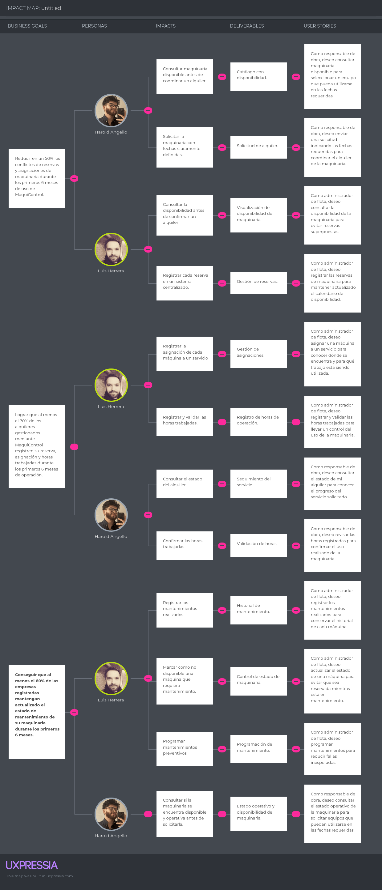

## 3.3 Product Backlog
| Orden | User Story ID | Título | Descripción | Story Points |
| :---: | :---: | :--- | :--- | :---: |
| 1 | **US01** | Registrar maquinaria | Como propietario de una empresa de alquiler, deseo registrar una maquinaria con sus características para mantener actualizado el inventario. | 2 |
| 2 | **US02** | Consultar disponibilidad | Como administrador, deseo consultar la disponibilidad de una maquinaria por fecha para evitar reservas duplicadas. | 2 |
| 3 | **US03** | Gestionar mantenimiento | Como propietario, deseo actualizar el estado de mantenimiento de una maquinaria para evitar que sea reservada cuando no está operativa. | 3 |
| 4 | **US04** | Crear reserva | Como contratista, deseo reservar una maquinaria disponible para utilizarla en mi obra durante el periodo requerido. | 3 |
| 5 | **US05** | Evitar reservas duplicadas | Como administrador, deseo evitar reservas que se superpongan para garantizar una correcta gestión de la disponibilidad. | 3 |
| 6 | **US06** | Cancelar reserva | Como administrador, deseo cancelar una reserva para liberar la maquinaria cuando ya no sea necesaria. | 2 |
| 7 | **US07** | Consultar catálogo | Como contratista, deseo consultar el catálogo de maquinarias para elegir el equipo adecuado para mi obra. | 1 |
| 8 | **US08** | Consultar tarifas | Como contratista, deseo consultar las tarifas de alquiler para calcular el presupuesto de mi obra. | 1 |
| 9 | **US09** | Consultar reservas por obra | Como contratista, deseo consultar las reservas asociadas a mi obra para organizar el uso de las maquinarias contratadas. | 2 |
| 10 | **US10** | Registrar horas trabajadas | Como administrador, deseo registrar las horas trabajadas por cada maquinaria para calcular correctamente el costo del servicio. | 3 |
| 11 | **US11** | Validar horas trabajadas | Como propietario, deseo validar las horas registradas para asegurar que los cobros se basen en información correcta. | 3 |
| 12 | **US12** | Generar resumen de facturación | Como propietario, deseo obtener un resumen de facturación para controlar los ingresos generados por los alquileres. | 3 |
| 13 | **US13** | Mostrar propuesta de valor | Como visitante, deseo conocer la propuesta de valor de MaquiControl para identificar cómo puede ayudar a mi empresa. | 1 |
| 14 | **US14** | Mostrar información por segmento | Como visitante, deseo consultar información relacionada con mi tipo de negocio para determinar si MaquiControl se adapta a mis necesidades. | 1 |
| 15 | **US15** | Solicitar contacto o demostración | Como visitante, deseo enviar una solicitud de contacto para obtener más información sobre MaquiControl. | 1 |
| 16 | **US16** | Registrar nuevos usuarios | Como administrador del sistema, deseo registrar nuevos usuarios asignando roles específicos para controlar los accesos a la plataforma. | 2 |
| 17 | **US17** | Iniciar sesión | Como usuario registrado, deseo autenticarme en el sistema para acceder a las funciones asignadas a mi rol. | 2 |
| 18 | **US18** | Recuperar contraseña | Como usuario, deseo restablecer mi contraseña mediante correo electrónico para recuperar el acceso a mi cuenta. | 2 |
| 19 | **US19** | Actualizar perfil de usuario | Como usuario, deseo modificar mis datos personales y de contacto para mantener mi información actualizada. | 1 |
| 20 | **US20** | Filtrar maquinaria por categoría | Como contratista, deseo filtrar los equipos por categoría (excavadoras, grúas, etc.) para encontrar más rápido lo que necesito. | 1 |
| 21 | **US21** | Buscar maquinaria por ubicación | Como contratista, deseo buscar equipos según su ubicación geográfica para reducir costos de transporte. | 2 |
| 22 | **US22** | Editar datos de maquinaria | Como propietario, deseo modificar las especificaciones técnicas o precio de una máquina registrada para reflejar cambios reales. | 2 |
| 23 | **US23** | Dar de baja maquinaria | Como propietario, deseo desactivar una maquinaria fuera de servicio para retirarla del catálogo activo. | 1 |
| 24 | **US24** | Cargar fotos de maquinaria | Como propietario, deseo subir imágenes de cada equipo para mostrar su estado visual a los clientes. | 2 |
| 25 | **US25** | Programar mantenimiento preventivo | Como propietario, deseo agendar alertas de mantenimiento periódico por horas de uso para prevenir averías. | 3 |
| 26 | **US26** | Registrar ficha técnica de reparación | Como mecánico, deseo ingresar el detalle de repuestos y reparaciones efectuadas a un equipo para guardar el historial. | 2 |
| 27 | **US27** | Consultar historial de mantenimiento | Como propietario, deseo revisar el historial mecánico de una máquina para evaluar su rentabilidad y desgaste. | 2 |
| 28 | **US28** | Modificar fechas de reserva | Como contratista, deseo solicitar la extensión de una reserva activa para continuar con los trabajos en obra. | 3 |
| 29 | **US29** | Aprobar o rechazar reservas | Como administrador, deseo revisar y aprobar solicitudes de alquiler pendientes para confirmar el contrato. | 2 |
| 30 | **US30** | Generar contrato de alquiler | Como administrador, deseo generar automáticamente el documento de contrato en PDF para formalizar el alquiler. | 3 |
| 31 | **US31** | Asignar operador a maquinaria | Como administrador, deseo vincular un operador certificado a una maquinaria reservada para asegurar su correcta manipulación. | 2 |
| 32 | **US32** | Registrar check-in de maquinaria | Como operador, deseo registrar la entrega física del equipo en obra anotando el estado inicial del horómetro. | 2 |
| 33 | **US33** | Registrar check-out de maquinaria | Como operador, deseo registrar la devolución del equipo adjuntando fotos y lectura final del horómetro. | 2 |
| 34 | **US34** | Reportar avería en obra | Como contratista, deseo notificar una falla mecánica urgente desde la aplicación para solicitar soporte técnico. | 2 |
| 35 | **US35** | Reasignar maquinaria por avería | Como administrador, deseo reemplazar una máquina fallada por otra disponible para no paralizar la obra del cliente. | 3 |
| 36 | **US36** | Notificar alertas de pago | Como sistema, deseo enviar recordatorios automáticos de cobro al contratista para evitar retrasos en los pagos. | 2 |
| 37 | **US37** | Emitir comprobante electrónico SUNAT | Como propietario, deseo generar facturas/boletas electrónicas vinculadas al servicio para cumplir con la normativa fiscal. | 3 |
| 38 | **US38** | Aplicar penalizaciones por mora | Como propietario, deseo calcular recargos automáticos en caso de devolución tardía de la maquinaria. | 2 |
| 39 | **US39** | Descargar reportes en Excel/PDF | Como administrador, deseo exportar las listas de reservas y facturación para análisis financiero externo. | 2 |
| 40 | **US40** | Calificar servicio y maquinaria | Como contratista, deseo dejar una valoración e inquietudes del equipo utilizado para alimentar la reputación del catálogo. | 1 |
| 41 | **US41** | Calculadora de ROI en Landing Page | Como visitante, deseo ingresar la cantidad de máquinas de mi flota para calcular el ahorro de tiempo estimado con MaquiControl. | 2 |
| 42 | **US42** | Chat de soporte en vivo | Como visitante o usuario, deseo comunicarme mediante un chat en línea para resolver dudas comerciales o técnicas. | 2 |
| 43 | **TS01** | Consultar maquinaria mediante API | Como desarrollador, deseo consultar las maquinarias mediante un endpoint REST para integrar el inventario con otros sistemas. | 2 |
| 44 | **TS02** | Registrar reservas mediante API | Como desarrollador, deseo registrar reservas mediante un endpoint REST para permitir que otros sistemas creen reservas. | 3 |
| 45 | **TS03** | Validar conflictos mediante API | Como desarrollador, deseo validar los conflictos de fechas en la API para mantener la consistencia de la disponibilidad. | 3 |
| 46 | **TS04** | Validar datos de la API | Como desarrollador, deseo validar los datos recibidos por la API para evitar registros incompletos o incorrectos. | 2 |
| 47 | **TS05** | Autenticación con Tokens JWT | Como desarrollador, deseo implementar la seguridad basada en Tokens JWT para proteger las rutas privadas de la API. | 3 |
| 48 | **TS06** | Registro masivo de horómetros vía API | Como desarrollador, deseo implementar un endpoint batch para sincronizar múltiples lecturas de horómetro desde apps móviles. | 3 |
| 49 | **TS07** | Endpoint para Facturación SUNAT | Como desarrollador, deseo crear la integración WebService con el Proveedor de Servicios Electrónicos (PSE) para emitir facturas. | 3 |
| 50 | **TS08** | Configuración de Webhooks de Eventos | Como desarrollador, deseo configurar webhooks para notificar cambios de estado en las reservas a sistemas externos. | 3 |

# Capítulo IV: Product Design

## 4.1. Style Guidelines

En esta sección se presentan las principales decisiones visuales y de estilo utilizadas en MaquiControl con el objetivo de mantener una experiencia consistente entre la Landing Page y la Web Application.

Se definen criterios relacionados con identidad visual, paleta de colores, tipografía, jerarquía visual, componentes, espaciado y comportamiento responsive. Estas decisiones permiten establecer una base común para el diseño y desarrollo de las interfaces del producto digital.

### 4.1.1. General Style Guidelines

La identidad visual de MaquiControl busca transmitir una imagen profesional, tecnológica y orientada a la gestión de maquinaria.

La interfaz utiliza principalmente una paleta oscura acompañada de elementos en color naranja para resaltar acciones importantes y componentes interactivos.

Los principales colores utilizados son:

#### Color Palette

MaquiControl utiliza una paleta de colores de alto contraste que combina superficies oscuras con un color naranja de acento para destacar acciones importantes.

| Uso | Vista | Código HEX |
|---|---|---|
| Background |  | `#0F1115` |
| Surface |  | `#171A20` |
| Secondary Surface |  | `#1F232B` |
| Primary Text |  | `#F5F5F5` |
| Secondary Text |  | `#A8ADB8` |
| Primary Accent |  | `#F59E0B` |
| Secondary Accent |  | `#D97706` |
| Borders |  | `#2A2F38` |

#### Typography
La tipografía principal utilizada es `Inter`, con fuentes alternativas Arial, Helvetica y sans-serif.

La jerarquía visual se establece mediante diferentes tamaños y pesos tipográficos, utilizando títulos grandes para comunicar la propuesta de valor y textos secundarios con menor contraste para información complementaria.

También se mantienen criterios consistentes de diseño como:

| Elemento | Tipografía | Peso aproximado | Aplicación |
|---|---|---|---|
| Main Headings | Inter | Bold / 700 | Hero y títulos principales |
| Section Headings | Inter | Bold / 700 | Títulos de secciones |
| Card Titles | Inter | Semi Bold / 600 | Beneficios, perfiles y pasos |
| Body Text | Inter | Regular / 400 | Descripciones y contenido |
| Buttons | Inter | Semi Bold / 600 | Call to Action |
| Navigation | Inter | Regular / 400-500 | Enlaces de navegación |

La jerarquía tipográfica se mantiene mediante variaciones de tamaño y peso, permitiendo distinguir claramente títulos, subtítulos, textos descriptivos y acciones.

### 4.1.2. Web Style Guidelines

La Landing Page de MaquiControl aplica un sistema visual consistente a sus principales componentes.

#### Typography

La interfaz utiliza la familia tipográfica:

`Inter, Arial, Helvetica, sans-serif`

Los títulos utilizan pesos elevados y tamaños responsivos mediante la función CSS `clamp()`, permitiendo adaptar su tamaño según el ancho de la pantalla.

#### Buttons

Los botones mantienen una altura y espaciado consistente y utilizan bordes redondeados.

Se emplean principalmente los siguientes estilos:

- **Primary Button:** fondo naranja (`#f59e0b`) y texto oscuro.
- **Secondary Button:** fondo transparente, texto claro y borde oscuro.
- **Outline Button:** fondo transparente con borde visible.

Los botones incluyen estados `hover` que modifican ligeramente el color o la posición del componente.

#### Cards

Las tarjetas se utilizan para organizar beneficios, segmentos, pasos del proceso y planes de suscripción.

Estas utilizan:

- Fondo `#171a20`.
- Bordes `#2a2f38`.
- Bordes redondeados.
- Espaciado interno amplio.
- Texto principal claro y contenido secundario en tonos grises.

#### Responsive Design

La Landing Page adapta sus layouts mediante CSS responsive.

En pantallas grandes se utilizan estructuras de múltiples columnas para beneficios, segmentos, pasos y planes.

En pantallas pequeñas estas estructuras se reorganizan verticalmente para facilitar la lectura y la interacción.

#### Accessibility

Los enlaces y botones incorporan estilos `focus-visible` para facilitar la navegación mediante teclado.

Cuando un elemento recibe foco, se utiliza un contorno de color naranja:

css
`outline: 3px solid var(--accent);`
`outline-offset: 4px;`

## 4.2. Information Architecture

La arquitectura de información de MaquiControl se encuentra orientada a organizar de manera clara y progresiva la información relacionada con la gestión y alquiler de maquinaria. La estructura de la Landing Page presenta inicialmente la propuesta de valor de la solución y posteriormente desarrolla sus principales beneficios, segmentos objetivo, funcionamiento y planes, facilitando que los usuarios comprendan progresivamente la propuesta antes de realizar una acción.

### 4.2.1. Organization Systems

La información de la Landing Page de MaquiControl se organiza mediante una estructura secuencial y jerárquica.

El contenido se presenta desde información general hacia información más específica, permitiendo que el visitante comprenda progresivamente la propuesta de valor de la plataforma.

La organización principal es la siguiente:

1. Header y navegación.
2. Presentación principal de MaquiControl.
3. Beneficios principales.
4. Identificación de perfiles de usuario.
5. Explicación del funcionamiento de la plataforma.
6. Propuesta de valor y trazabilidad.
7. Call to Action final.
8. Footer.

Además, la información relacionada se agrupa mediante tarjetas, especialmente en las secciones de beneficios, perfiles y pasos del proceso.

### 4.2.2. Labeling Systems

El sistema de etiquetado utiliza textos breves y directos que permiten identificar claramente cada sección y acción de la Landing Page.

Entre las principales etiquetas utilizadas se encuentran:

- Inicio
- Beneficios
- Cómo funciona
- Nosotros
- Gestionar mi flota
- Buscar maquinaria
- Soy propietario
- Necesito maquinaria
- Consulta
- Coordina
- Controla
- Comenzar ahora

Las etiquetas utilizan lenguaje relacionado directamente con las necesidades de los usuarios y con las principales acciones disponibles en MaquiControl.

### 4.2.3. SEO Tags and Meta Tags

La Landing Page de MaquiControl incorpora etiquetas HTML orientadas a mejorar la identificación del sitio por los motores de búsqueda y proporcionar información básica sobre el contenido de la página.

En el elemento `<head>` se han implementado las siguientes etiquetas:

- **Title:** `MaquiControl | Machinery Rental Management`
- **Description:** describe a MaquiControl como una plataforma para la gestión de flotas, reservas, disponibilidad y mantenimiento de maquinaria.
- **Keywords:** incluye términos relacionados con alquiler de maquinaria, gestión de flotas, maquinaria pesada, alquiler de equipos, mantenimiento y MaquiControl.
- **Author:** identifica a `AndesHeavyTech` como autor del sitio.

Además, se incluyen etiquetas técnicas necesarias para una correcta visualización:

- `charset="UTF-8"` para la codificación de caracteres.
- `viewport` para adaptar correctamente la página a dispositivos móviles.

La configuración implementada en la Landing Page es la siguiente:

`<meta charset="UTF-8">`

`<meta name="viewport"
      content="width=device-width, initial-scale=1.0">`

`<meta name="description"
      content="MaquiControl helps machinery rental businesses manage fleets, reservations, availability and maintenance from one platform.">`

`<meta name="keywords"
      content="machinery rental, fleet management, heavy machinery, equipment rental, maintenance, MaquiControl">`

`<meta name="author"
      content="AndesHeavyTech">`

`<title>MaquiControl | Machinery Rental Management</title>`

### 4.2.4. Searching Systems

La Landing Page de MaquiControl no incorpora un sistema de búsqueda interno.

El acceso a funciones de búsqueda de maquinaria se realiza mediante llamadas a la acción como "Buscar maquinaria" y "Necesito maquinaria", las cuales están orientadas a dirigir al usuario hacia la Web Application.

El sistema de búsqueda detallado forma parte de la funcionalidad de la Web Application y no de la Landing Page.

### 4.2.5. Navigation Systems

La Landing Page utiliza una navegación principalmente lineal y mediante anclas internas.

En la versión Desktop, el header incluye accesos a:

- Inicio
- Beneficios
- Cómo funciona
- Nosotros

Además, se incluye el botón "Ir a la plataforma" como acceso principal hacia la aplicación.

En la versión Mobile, la navegación se simplifica mediante un menú compacto, permitiendo mantener la interfaz limpia en pantallas pequeñas.

La navegación también se complementa con diferentes Call to Action distribuidos a lo largo de la página, como:

- Gestionar mi flota.
- Buscar maquinaria.
- Soy propietario.
- Necesito maquinaria.
- Comenzar ahora.

Estas acciones permiten dirigir al usuario hacia la experiencia correspondiente según su perfil.

[Por agregar: Mapa de navegación de MaquiControl]

### 4.3. Landing Page UI Design

En esta sección se presenta el diseño de la Landing Page de MaquiControl, desarrollado a partir de los lineamientos visuales definidos previamente y de las necesidades de los segmentos objetivo.

El diseño busca comunicar de forma clara la propuesta de valor de MaquiControl, presentar sus principales beneficios y orientar a los visitantes hacia las acciones correspondientes según su perfil.

Para validar la estructura y apariencia de la interfaz, se elaboraron wireframes y mock-ups en versiones Desktop y Mobile, permitiendo representar tanto la organización inicial de los contenidos como la propuesta visual de alta fidelidad.

### 4.3.1. Landing Page Wireframes

En esta sección se presentan los wireframes de la Landing Page de MaquiControl.
Estos diseños representan la estructura inicial de la interfaz, la distribución de los principales componentes y la jerarquía de información antes de aplicar los estilos visuales definitivos.

Los wireframes consideran las principales secciones de la Landing Page:

- Header y navegación principal.
- Hero Section.
- Beneficios de MaquiControl.
- Segmentos objetivo.
- Sección "Cómo funciona".
- Propuesta de valor.
- Planes de suscripción.
- Call to Action final.
- Footer.

Asimismo, se consideran versiones adaptadas para diferentes tamaños de pantalla, principalmente Desktop y Mobile.

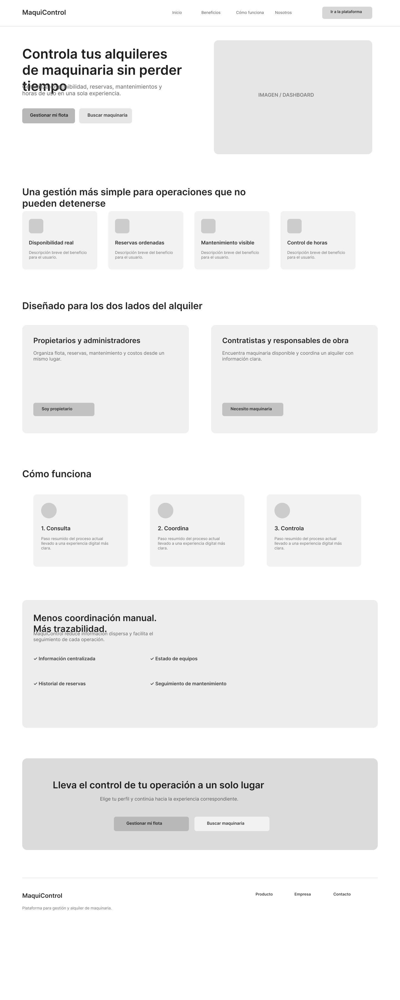

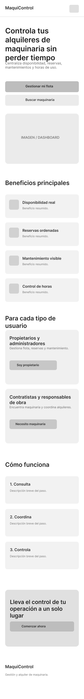

### 4.3.2. Landing Page Mock-ups

En esta sección se presentan los mockups de alta fidelidad de la Landing Page de MaquiControl.

Los mockups aplican la identidad visual definida previamente, incluyendo colores, tipografía, componentes, botones, tarjetas, iconografía y distribución responsive.

La interfaz final está compuesta por las siguientes secciones:

- Header.
- Hero Section.
- Benefits Section.
- Target Segments Section.
- How It Works Section.
- Value Proposition.
- Pricing Section.
- Final Call to Action.
- Footer.

Los diseños contemplan versiones Desktop y Mobile con el objetivo de mantener una experiencia consistente en diferentes dispositivos.

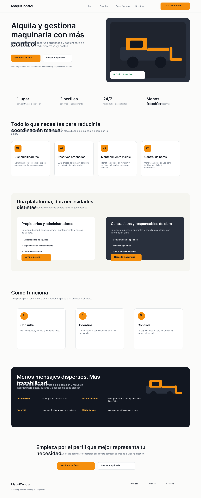

## 4.4. Web Applications UX/UI Design

En esta sección se presenta el proceso de diseño UX/UI de la Web Application de MaquiControl.

El diseño fue desarrollado tomando como referencia las necesidades identificadas durante la etapa de investigación, los User Personas, las User Stories y los principales procesos definidos para la plataforma.

Para representar progresivamente la experiencia de usuario se elaboraron wireframes, wireflow diagrams, mock-ups y user flow diagrams. Estos artefactos permiten visualizar la estructura de las interfaces, la relación entre las diferentes vistas y los recorridos que realizan los usuarios para completar sus principales tareas dentro de MaquiControl.### 4.4.1. Web Applications Wireframes

En esta sección se presentan los wireframes de la Web Application de MaquiControl. Estos diseños de baja fidelidad permiten representar la estructura, distribución y jerarquía de los principales elementos de la interfaz antes de aplicar los estilos visuales definitivos.

Los wireframes muestran las principales vistas y funcionalidades de la aplicación, considerando las necesidades de los segmentos objetivo identificados durante la etapa de investigación. Asimismo, permiten validar la ubicación de componentes, navegación entre vistas y organización de la información antes de desarrollar los mock-ups de alta fidelidad.

A continuación, se presentan los wireframes correspondientes a las principales vistas de la Web Application de MaquiControl.

### 4.4.1. Web Applications Wireframes

Los wireframes de MaquiControl representan la estructura inicial de las principales vistas de la Web Application antes de aplicar los estilos visuales definitivos.

Estos diseños de baja fidelidad permiten establecer la distribución de los componentes, la jerarquía de la información y la ubicación de los principales elementos de interacción.

Los wireframes fueron elaborados considerando los principales procesos de la plataforma, permitiendo validar la organización de las vistas antes de desarrollar los mock-ups de alta fidelidad.

A continuación, se presentan los wireframes correspondientes a las principales interfaces de la Web Application de MaquiControl.
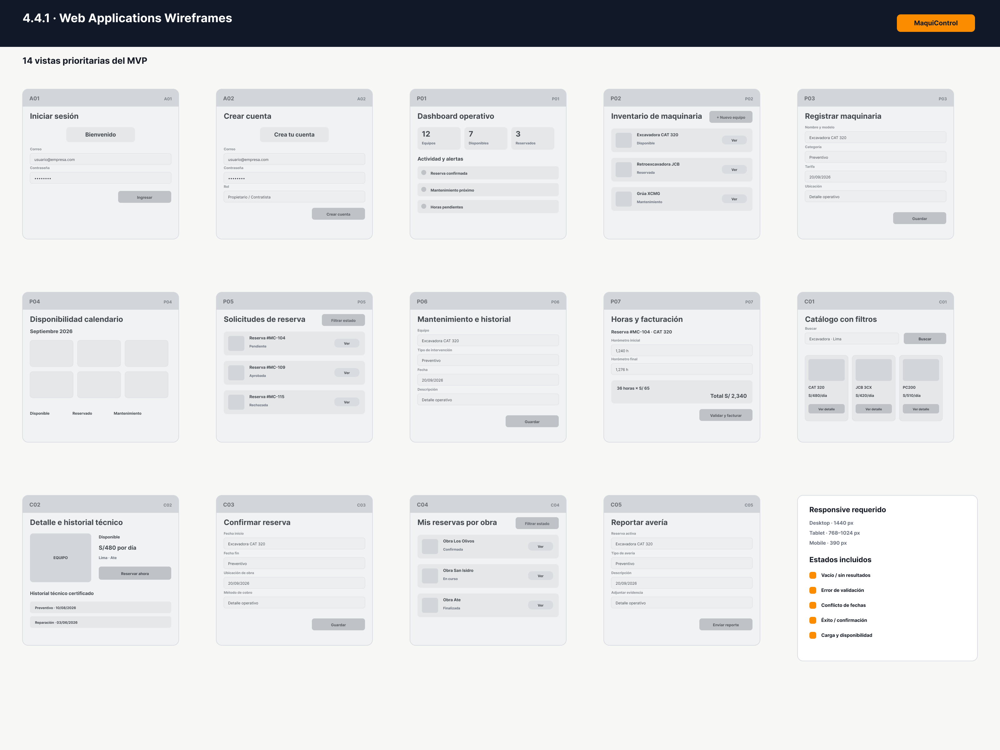

### 4.4.2. Web Applications Wireflow Diagrams

Los Wireflow Diagrams permiten representar la relación entre los wireframes y las acciones que conectan las diferentes vistas de la Web Application de MaquiControl.

Estos diagramas muestran cómo el usuario puede desplazarse entre las interfaces para completar determinadas tareas, combinando la representación visual de las pantallas con las conexiones que describen el flujo de navegación.

Los wireflows permiten validar la continuidad de la experiencia y detectar posibles problemas de navegación antes de la implementación de la aplicación.

A continuación, se presentan los principales Wireflow Diagrams de MaquiControl.
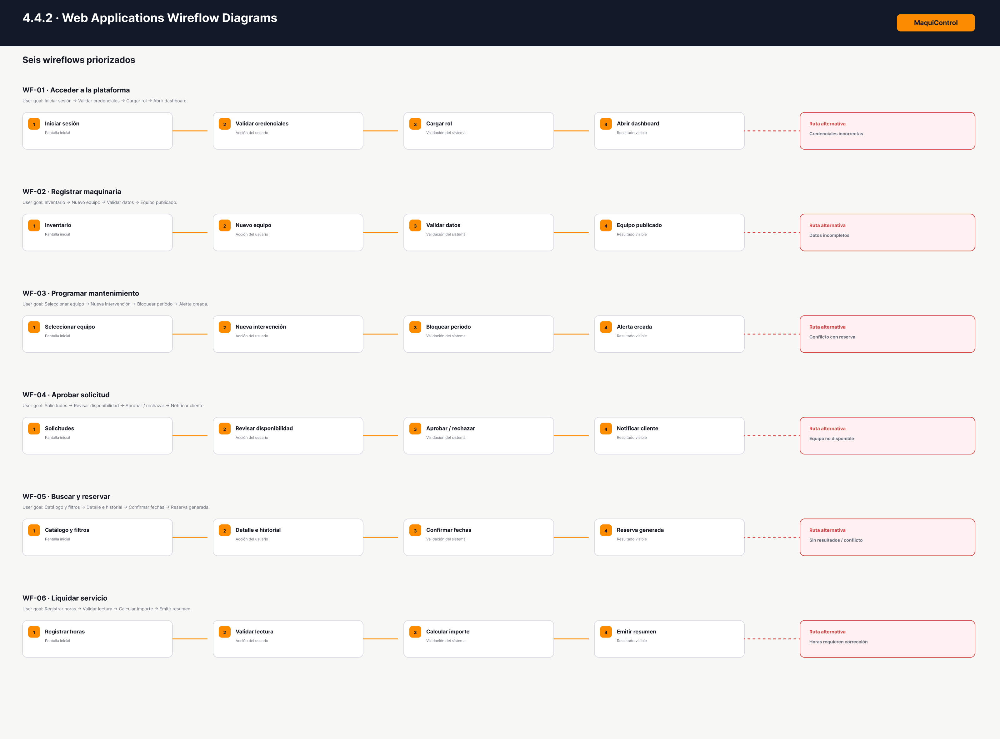

### 4.4.2. Web Applications Mock-ups

Los mock-ups presentan la propuesta visual de alta fidelidad de la Web Application de MaquiControl.

A diferencia de los wireframes, estas interfaces incorporan la identidad visual definida en las Style Guidelines, incluyendo colores, tipografía, iconografía, componentes, botones, tarjetas, estados visuales y jerarquías de información.

Los mock-ups permiten representar de manera más cercana la apariencia final de la aplicación y sirven como referencia visual para la etapa de implementación.

A continuación, se presentan los mock-ups correspondientes a las principales vistas de la Web Application de MaquiControl.
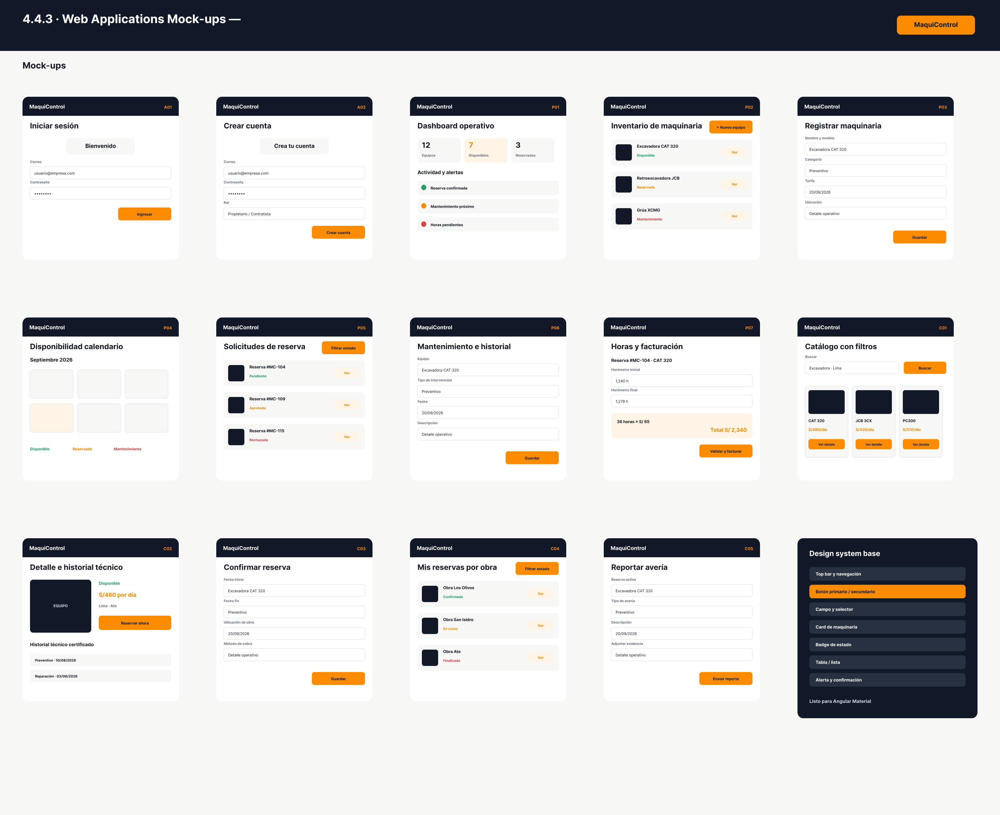

### 4.4.3. Web Applications User Flow Diagrams

Los User Flow Diagrams representan los recorridos que realizan los usuarios para completar las principales tareas dentro de la Web Application de MaquiControl.

Estos diagramas muestran las acciones, decisiones y transiciones entre diferentes vistas, permitiendo comprender cómo cada tipo de usuario interactúa con la plataforma para alcanzar un objetivo determinado.

Los flujos fueron definidos tomando como referencia las User Stories y las necesidades identificadas para los User Personas de MaquiControl.

A continuación, se presentan los principales User Flow Diagrams de la aplicación.
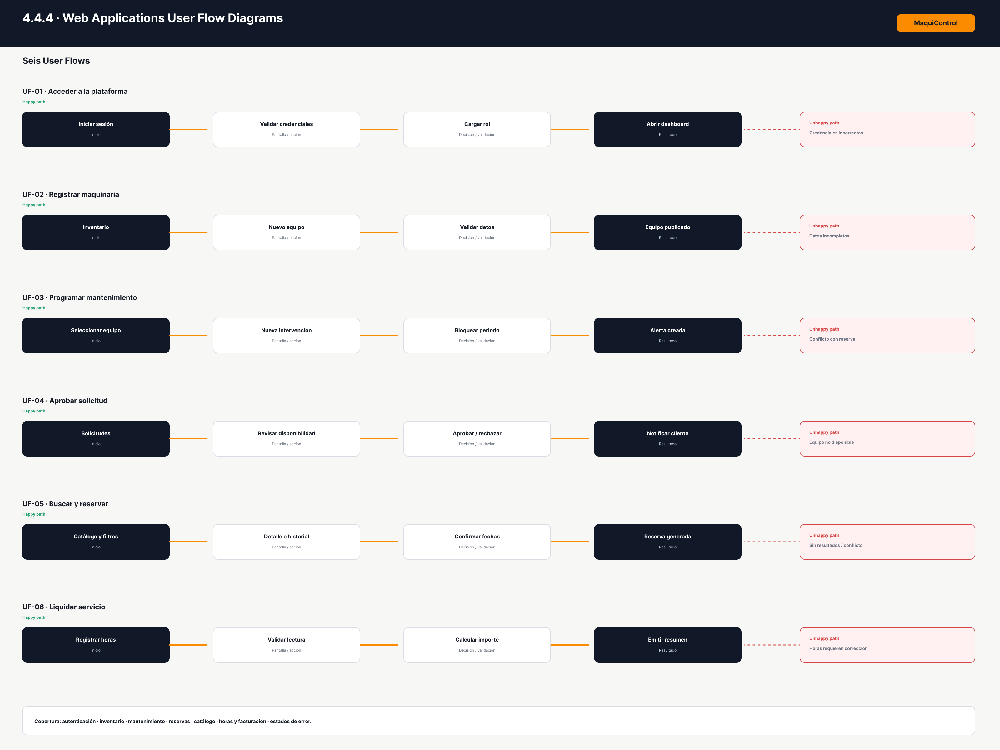

## 4.5 Web Applications Prototyping
En esta sección se presenta el prototipo interactivo de la Web Application de MaquiControl, desarrollado a partir de los mock-ups y User Flow Diagrams definidos previamente.

El prototipo permite simular la navegación entre las principales vistas de la aplicación y validar la secuencia de interacción que siguen los usuarios para completar sus tareas principales. Las conexiones entre pantallas fueron definidas considerando los recorridos planteados en los User Flows y el sistema de navegación establecido para la aplicación.

Se consideraron las principales funcionalidades de MaquiControl, como el acceso a la plataforma, visualización del dashboard, consulta y gestión de maquinaria, reservas, mantenimiento, disponibilidad y seguimiento de servicios.

A continuación, se presenta una captura del prototipo en funcionamiento y el enlace al video de demostración, donde se muestran los principales flujos de navegación e interacción de la aplicación.
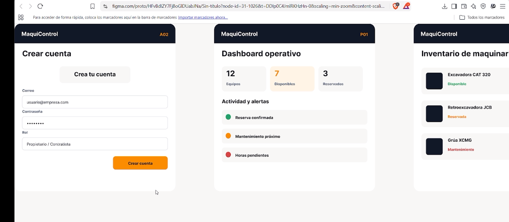
**Video:** [MaquiControl Web Application Prototype](https://upcedupe-my.sharepoint.com/:v:/g/personal/u202416147_upc_edu_pe/IQDTToyT3z0WS4p91D9YPA8hAZ7EcCttmB3Q_ULdJAyTY0Q?e=SnpDhm&nav=eyJyZWZlcnJhbEluZm8iOnsicmVmZXJyYWxBcHAiOiJTdHJlYW1XZWJBcHAiLCJyZWZlcnJhbFZpZXciOiJTaGFyZURpYWxvZy1MaW5rIiwicmVmZXJyYWxBcHBQbGF0Zm9ybSI6IldlYiIsInJlZmVycmFsTW9kZSI6InZpZXcifX0%3D)

## 4.6. Domain-Driven Software Architecture

En esta sección se presenta la arquitectura de software de MaquiControl desde una perspectiva orientada al dominio.

La propuesta arquitectónica toma como referencia los procesos de negocio identificados previamente, el Ubiquitous Language, el Big Picture Event Storming y los principales requerimientos funcionales de la plataforma.

A partir de estos elementos se identifican los principales límites del dominio, las responsabilidades del sistema y las relaciones entre los diferentes componentes que conforman la solución.

La arquitectura se documenta mediante Design-Level Event Storming y diagramas C4 a nivel de Context, Container y Component.
### 4.6.1. Design-Level Event Storming

En esta sección se presenta el Design-Level Event Storming de MaquiControl, desarrollado a partir del Big Picture Event Storming realizado previamente.

El objetivo de esta etapa es profundizar en el dominio del problema e identificar los principales Bounded Contexts, Aggregates, Commands, Domain Events, Queries y Read Models de la solución.

A partir del análisis realizado se identificaron los siguientes Bounded Contexts principales: Fleet Management, Rental Management, Maintenance Management, Operations Management, Identity & Access Management y Profiles Management.

#### Fleet Management Bounded Context

Este Bounded Context concentra las responsabilidades relacionadas con la gestión de la maquinaria, incluyendo su registro, actualización de información, cambio de estado, consulta de inventario y disponibilidad.

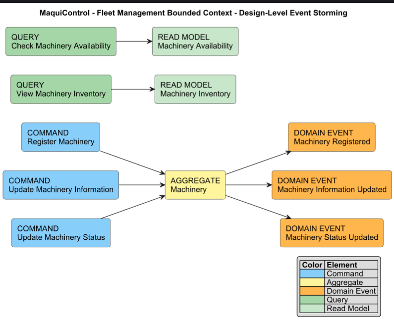
#### Rental Management Bounded Context

Este Bounded Context gestiona las solicitudes y reservas de maquinaria, incluyendo la creación de solicitudes, confirmación, cancelación y actualización de las fechas asociadas al alquiler.

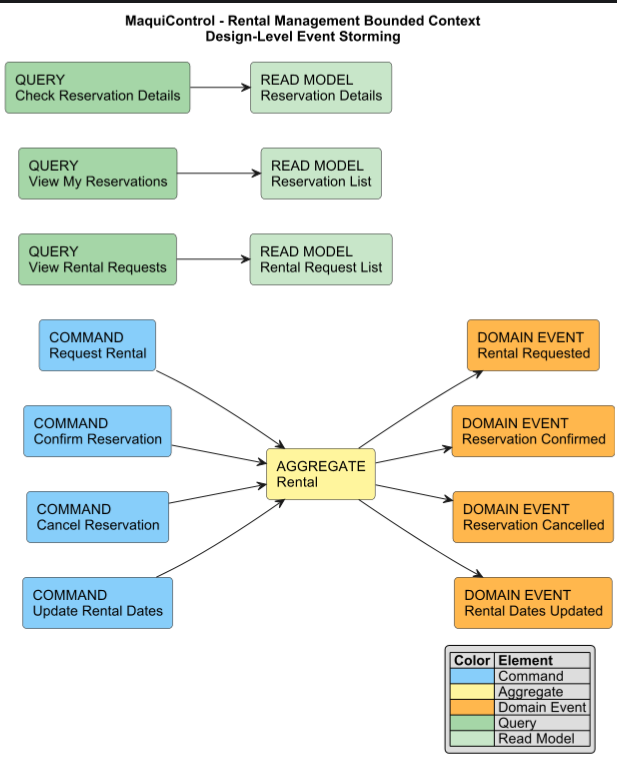

#### Maintenance Management Bounded Context

Este Bounded Context agrupa las responsabilidades relacionadas con el mantenimiento de la maquinaria. Incluye la programación y finalización de mantenimientos, el reporte de averías y la actualización del estado de mantenimiento. Su agregado principal es Maintenance y permite además consultar el historial, los mantenimientos pendientes y el detalle de cada intervención realizada.

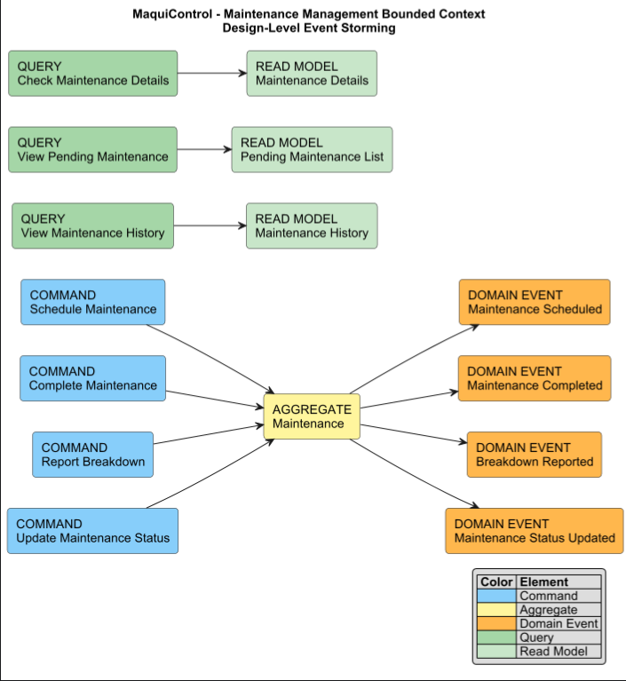

#### Operations Management Bounded Context

Este Bounded Context representa la ejecución operativa de los servicios realizados con la maquinaria. Incluye el inicio y finalización de un servicio, el registro de horas trabajadas y la validación de dichas horas. Su agregado principal es Service Operation y permite consultar el estado del servicio, el resumen de horas trabajadas y el historial de operaciones.

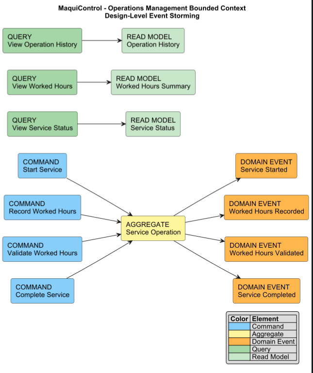

#### Identity & Access Management Bounded Context

Este Bounded Context se encarga de la gestión de identidad, autenticación y control de acceso de los usuarios de MaquiControl. Incluye el registro de cuentas, la autenticación, la asignación de roles y el cambio de contraseñas. Su agregado principal es User Account y permite consultar los datos de la cuenta, los roles asignados y el estado de autenticación.

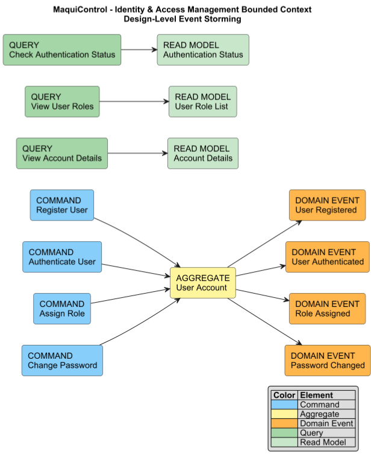

#### Profiles Management Bounded Context

Este Bounded Context gestiona la información asociada a los perfiles de los usuarios. Incluye la creación y actualización de perfiles, datos de contacto e información de la organización. Su agregado principal es Profile y permite consultar la información personal, de contacto y organizacional asociada a cada usuario.

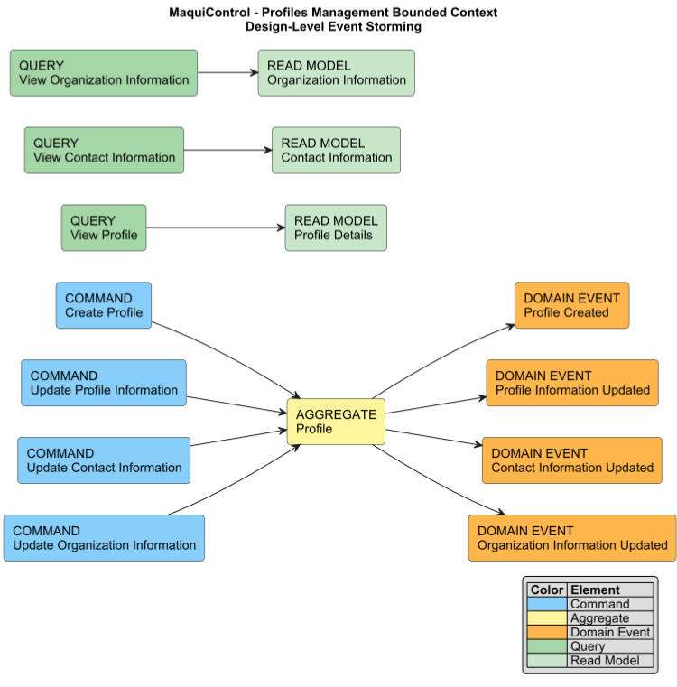

### 4.6.2. Software Architecture Context Diagram

El Software Architecture Context Diagram presenta a MaquiControl como el sistema principal y muestra su relación con los principales tipos de usuario identificados en el proyecto.

El Fleet Administrator utiliza MaquiControl para gestionar la maquinaria, reservas, mantenimiento y operaciones asociadas al servicio. Por otro lado, el Contractor o Site Manager utiliza la plataforma para consultar maquinaria disponible, solicitar alquileres y realizar seguimiento de los servicios contratados.

Este nivel del modelo C4 permite visualizar el alcance general de MaquiControl y las principales interacciones entre el sistema y sus usuarios.

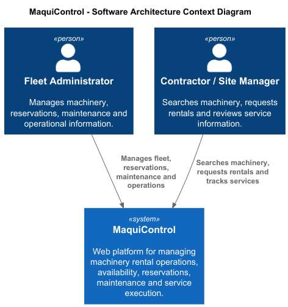

### 4.6.3. Software Architecture Container Diagram

El Software Architecture Container Diagram muestra la estructura de alto nivel de MaquiControl y la distribución de responsabilidades entre los principales elementos de la solución.

La aplicación está compuesta por una Single Page Application desarrollada con Angular, una REST API desarrollada con Spring Boot y Java, y una base de datos relacional encargada de la persistencia de la información.

Los usuarios interactúan con la aplicación web mediante un navegador. La Single Page Application consume los servicios proporcionados por la REST API utilizando HTTPS y JSON. A su vez, la API gestiona el acceso a la información persistida mediante Spring Data JPA.

Este nivel del modelo C4 permite visualizar las principales decisiones tecnológicas de la solución y la comunicación entre los containers que conforman MaquiControl.

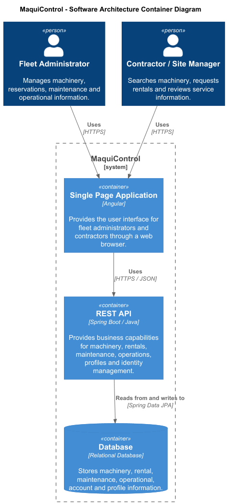

### 4.6.4. Software Architecture Components Diagrams

En esta sección se presentan los Component Diagrams de MaquiControl, los cuales permiten visualizar la descomposición interna del container correspondiente a la REST API.

En primer lugar, se muestra la organización general de los principales Bounded Contexts identificados durante el proceso de Domain-Driven Design. Posteriormente, se presenta el detalle interno de cada Bounded Context, mostrando sus principales capas y responsabilidades.

La estructura interna sigue una separación entre Interfaces Layer, Application Layer, Domain Layer e Infrastructure Layer, permitiendo mantener separadas las responsabilidades del dominio y los aspectos técnicos de la implementación.

#### API Application Component Diagram

El siguiente diagrama muestra la organización general de la REST API de MaquiControl y los principales Bounded Contexts que forman parte de la solución: Identity & Access Management, Profiles Management, Fleet Management, Rental Management, Maintenance Management y Operations Management.

También se representan las principales relaciones entre los contextos, la Single Page Application y la base de datos.

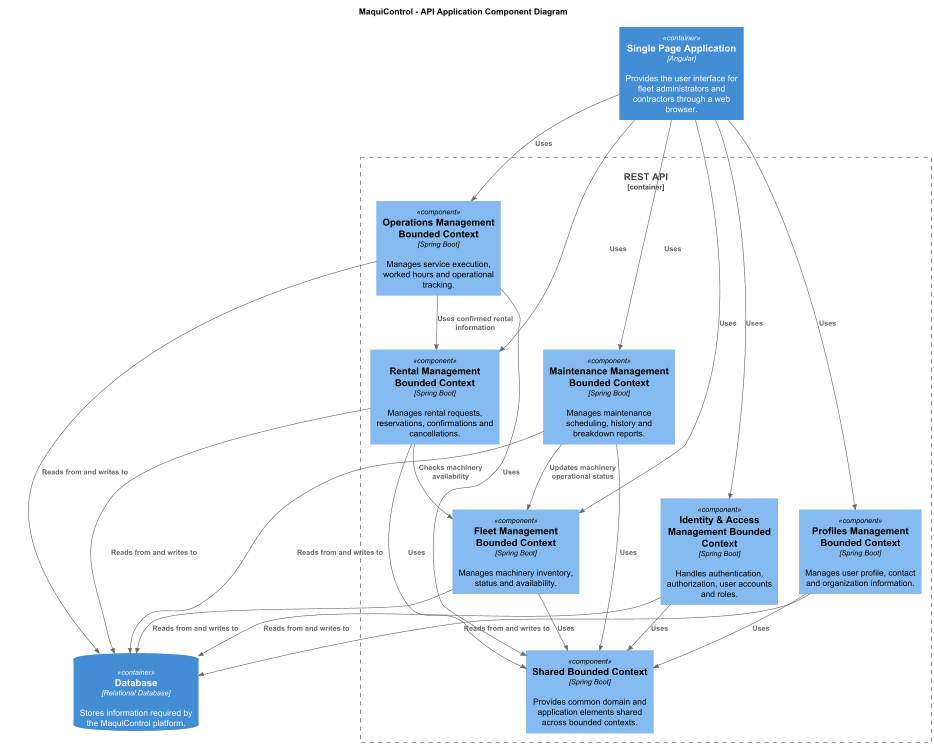

#### Fleet Management Bounded Context Component Diagram

Este diagrama presenta la estructura interna del Fleet Management Bounded Context. La Interfaces Layer expone los servicios relacionados con la gestión de maquinaria, mientras que la Application Layer coordina los casos de uso definidos para este contexto.

La Domain Layer contiene el aggregate Machinery y las reglas de negocio asociadas al inventario, estado y disponibilidad de la maquinaria. Finalmente, la Infrastructure Layer se encarga de la persistencia de la información.

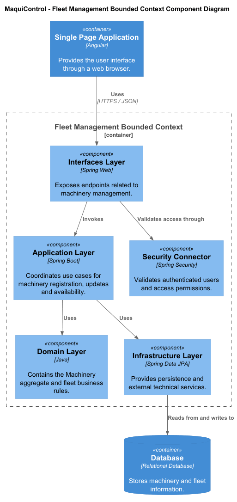

#### Rental Management Bounded Context Component Diagram

Este diagrama representa la estructura interna del Rental Management Bounded Context. Este contexto gestiona las solicitudes de alquiler, reservas, confirmaciones, cancelaciones y actualización de fechas.

La Domain Layer contiene el aggregate Rental, mientras que las demás capas permiten exponer, coordinar y persistir las operaciones asociadas al proceso de alquiler.

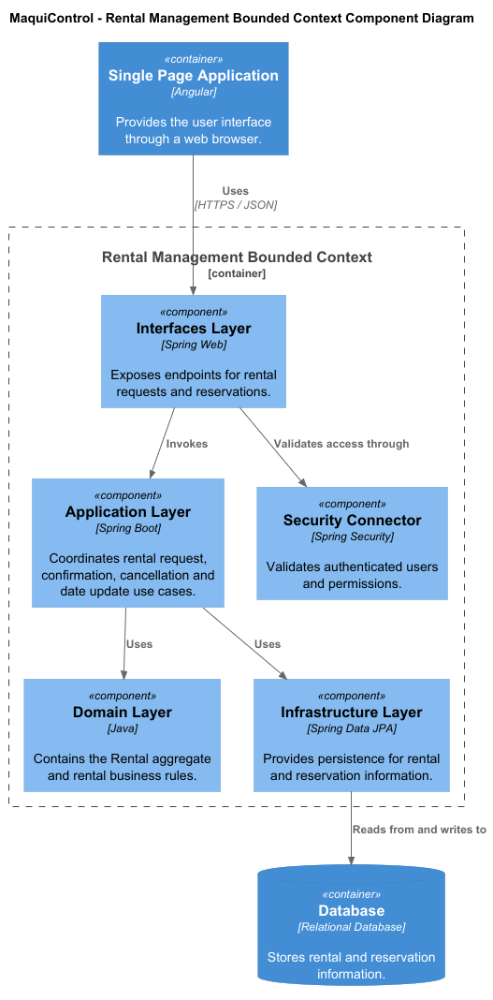

#### Maintenance Management Bounded Context Component Diagram

Este diagrama muestra la estructura interna del Maintenance Management Bounded Context, encargado de la programación de mantenimiento, reporte de averías, actualización de estados y mantenimiento del historial técnico de la maquinaria.

La Domain Layer contiene el aggregate Maintenance y las reglas de negocio relacionadas con estos procesos.

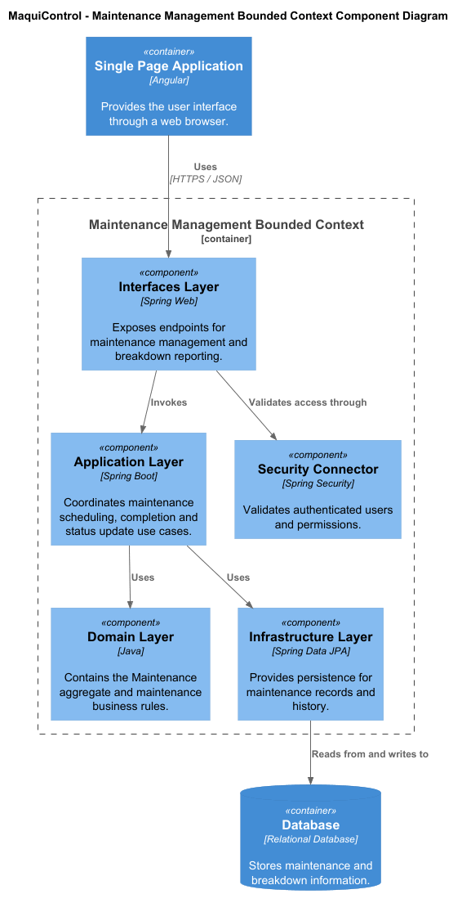

#### Operations Management Bounded Context Component Diagram

Este diagrama presenta la estructura interna del Operations Management Bounded Context. Este contexto administra la ejecución de servicios, el registro y validación de horas trabajadas y el seguimiento operativo.

La Domain Layer contiene el aggregate Service Operation, mientras que las demás capas coordinan la interacción entre la aplicación, el dominio y la persistencia.

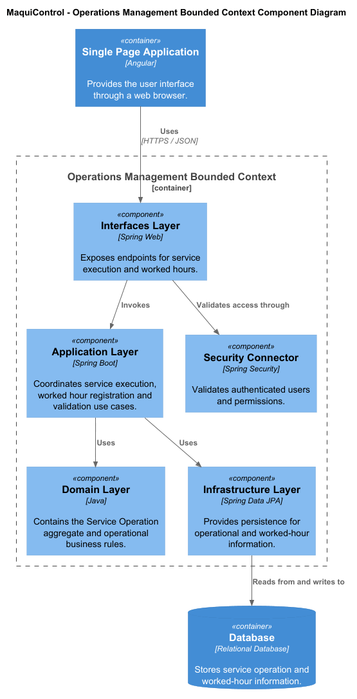

#### Identity & Access Management Bounded Context Component Diagram

Este diagrama representa la estructura interna del Identity & Access Management Bounded Context. Este contexto se encarga de la autenticación, autorización, gestión de cuentas, roles y credenciales de los usuarios de MaquiControl.

La Domain Layer contiene el aggregate User Account y las reglas asociadas al control de identidad y acceso.

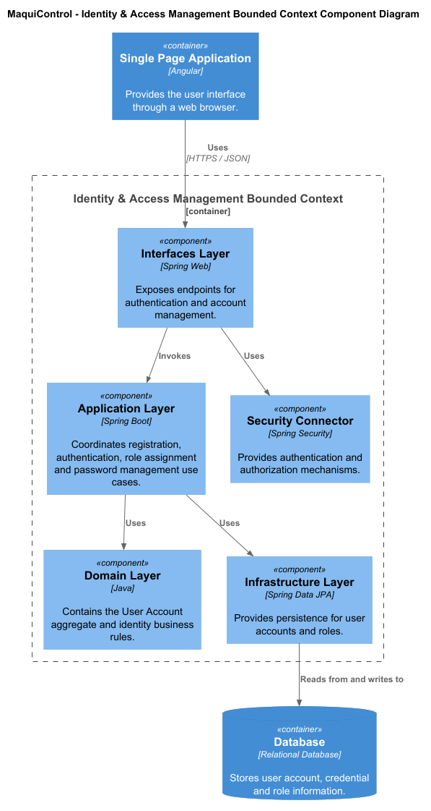

#### Profiles Management Bounded Context Component Diagram

Este diagrama muestra la estructura interna del Profiles Management Bounded Context, encargado de gestionar la información del perfil, datos de contacto e información de las organizaciones asociadas a los usuarios.

La Domain Layer contiene el aggregate Profile y sus reglas de negocio correspondientes.

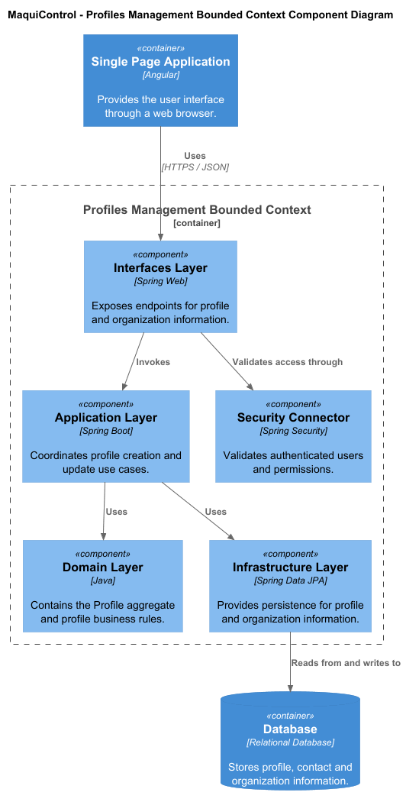

## 4.7 Software Object-Oriented Design

## 4.8 Database Design

# Capítulo V: Product Implementation, Validation & Deployment

## 5.1 Software Configuration Management

## 5.2 Landing Page, Services & Applications Implementation

## 5.3 Validation Interviews

## 5.4 Video About-the-Product

# Conclusiones

# Bibliografía

# Anexos
